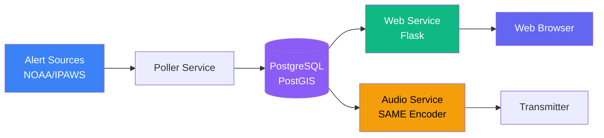
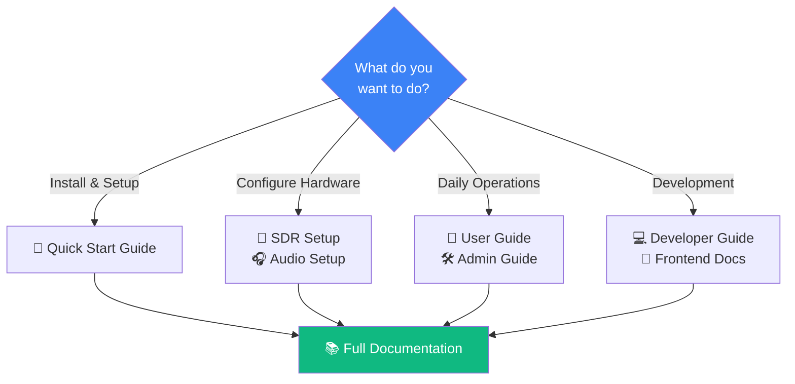
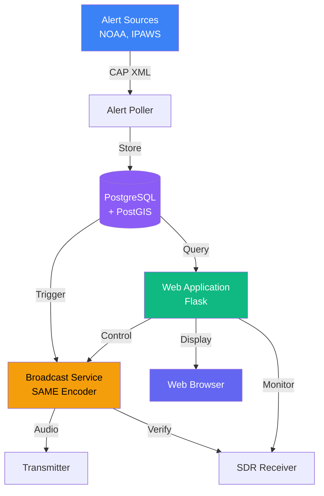

#  EAS Station

[](https://www.gnu.org/licenses/agpl-3.0)
[](LICENSE-COMMERCIAL)

[](https://www.python.org/)
[](https://flask.palletsprojects.com/)
[](https://www.sqlalchemy.org/)
[](https://www.postgresql.org/)
[](https://redis.io/)

[](https://systemd.io/)
[](https://gunicorn.org/)
[](https://nginx.org/)
[](https://getbootstrap.com/)
[](https://leafletjs.com/)

> **A professional Emergency Alert System (EAS) platform for monitoring, broadcasting, and verifying NOAA and IPAWS alerts**

EAS Station is a software-defined drop-in replacement for commercial EAS encoder/decoder hardware, built on commodity hardware like Raspberry Pi. It provides comprehensive alert processing with FCC-compliant SAME encoding, multi-source aggregation, PostGIS spatial intelligence, SDR verification, and integrated LED signage.

---

!!! warning "**IMPORTANT: Laboratory Use Only**"
    EAS Station is experimental software for research and development. It is **not FCC-certified** and must only be used in controlled test environments. Never use for production emergency alerting.

---

## ✨ Key Features

| Feature | Description |
|---------|-------------|
| 🌐 **Multi-Source Ingestion** | NOAA Weather, IPAWS federal alerts, and custom CAP feeds |
| 📻 **FCC-Compliant SAME** | Specific Area Message Encoding per FCC Part 11 |
| 🗺️ **Geographic Intelligence** | PostGIS spatial filtering with county/state/polygon support |
| 📡 **SDR Verification** | Automated broadcast verification with RTL-SDR/Airspy |
| 🔒 **Built-in HTTPS** | Automatic SSL/TLS with Let's Encrypt, nginx reverse proxy |
| 🎨 **Modern Web UI** | Responsive Bootstrap 5 interface with real-time updates |
| ⚡ **Hardware Integration** | GPIO relay control, LED signs, multiple audio outputs |

## 🏗️ Architecture

**Separated Service Design** - Modern, reliable, production-grade architecture:



**Benefits:**
- ✅ **Reliable** - Services isolated (web crashes don't affect audio)
- ✅ **Simple** - No complex worker coordination
- ✅ **Fast** - Dedicated resources per service
- ✅ **Debuggable** - Separate logs, independent restart

### Project Structure

```
eas-station/
├── app.py                      # Main Flask application
├── *_service.py                # Service entry points (EAS, SDR, hardware, audio)
├── wsgi.py                     # WSGI server entry point
├── app_core/                   # Core business logic
│   ├── audio/                  # Audio processing and EAS monitoring
│   ├── radio/                  # SDR radio management
│   ├── auth/                   # Authentication and RBAC
│   └── models.py               # Database models
├── app_utils/                  # Utility modules
│   ├── eas.py                  # SAME encoding/generation
│   ├── eas_decode.py           # SAME decoding
│   └── eas_tts.py              # Text-to-speech synthesis
├── webapp/                     # Web application routes and templates
│   ├── admin/                  # Admin routes and API
│   └── templates/              # Jinja2 HTML templates
├── poller/                     # CAP feed polling service
├── static/                     # Frontend assets (CSS, JS, images)
├── scripts/                    # Utility and maintenance scripts
│   ├── debug/                  # Debug and testing scripts
│   ├── fixes/                  # One-time fix scripts
│   ├── diagnostics/            # Diagnostic tools
│   └── maintenance/            # Database and system maintenance
├── tests/                      # Comprehensive test suite (80+ files)
├── docs/                       # Documentation
│   ├── guides/                 # Setup and user guides
│   ├── architecture/           # Architecture documentation
│   └── FUTURE_ENHANCEMENTS.md  # Planned enhancements
└── legacy/                     # Archived code for reference

**Key Files:**
- `app.py` - Main web application and Flask initialization
- `eas_service.py` - EAS monitoring service (subscribes to Redis audio)
- `sdr_hardware_service.py` - SDR hardware USB access (publishes IQ samples)
- `hardware_service.py` - GPIO, displays, and Zigbee hardware
- `eas_monitoring_service.py` - Audio processing and EAS monitoring
```

## 🚀 Quick Start

### One-Command Installation

```bash
git clone https://github.com/KR8MER/eas-station.git && \
cd eas-station && \
sudo bash install.sh
```

**That's it!** The installer automatically:
- ✅ Installs all dependencies (PostgreSQL, Redis, Python, nginx, etc.)
- ✅ Generates a secure SECRET_KEY
- ✅ Initializes the database schema
- ✅ Starts all services
- ✅ Configures HTTPS with self-signed certificate

> 💡 **Debian Trixie (Testing)**: Fully supported! The installer auto-detects your OS version and installs compatible packages. Python 3.13 is fully supported with the latest dependency updates.

### Access Your Station

Open your web browser and navigate to:
- **https://localhost** (on the server)
- **https://your-server-ip** (from network)

Accept the self-signed certificate warning (safe for initial setup).

### Complete Setup

1. **Create Administrator Account** - Set username and password via web interface
2. **Configure Station** - Use the setup wizard to configure:
   - Location (county, state, zone codes)
   - Callsign (EAS_STATION_ID)
   - Enable/disable features (SDR, broadcast, etc.)
3. **Done!** - Your station is ready to monitor alerts

> 💡 **Production SSL**: `sudo certbot --nginx -d your-domain.com`

### System Requirements

- **OS**: Debian 12 (Bookworm), Debian 13 (Trixie), Ubuntu 22.04+, or Raspberry Pi OS
- **CPU**: 2+ cores (4+ recommended)
- **RAM**: 2GB minimum (4GB+ recommended)
- **Storage**: 20GB minimum (50GB+ recommended for alerts database)
- **Network**: Internet connection for alert polling

### Key Benefits

- ✅ **Native Performance** - Runs directly on host OS
- ✅ **Direct Hardware Access** - SDR, GPIO, and audio devices work natively
- ✅ **Standard Linux Management** - Familiar systemd service control
- ✅ **Out-of-the-Box** - No manual configuration required
- ✅ **Web-Based Setup** - Configure everything through the UI

### Alternative: Bootable ISO

Build a pre-configured bootable ISO for dedicated hardware:

```bash
cd eas-station
sudo bash scripts/build-iso.sh
# Burn to USB: sudo dd if=eas-station-*.iso of=/dev/sdX bs=4M status=progress
```

**📖 Full Guide:** See [docs/installation/README.md](docs/installation/README.md) for detailed installation, upgrades, configuration, and troubleshooting.

### Installation Notes for Debian Trixie

**Debian 13 (Trixie)** is the current testing distribution and is fully supported:

- **Python 3.13**: All dependencies updated to support Python 3.13 (gevent 25.9.1+, pytest 9.0+, etc.)
- **PostgreSQL**: Works with PostgreSQL 15, 16, or 17 with PostGIS 3.3 or 3.4
- **Package availability**: All required packages are available in Trixie repositories
- **Testing status**: While Trixie is "testing", it's stable enough for development and lab use

If you encounter any package availability issues on Trixie, the installer will attempt to install from Debian Backports or skip optional packages gracefully.

## 📚 Documentation



### Quick Links

| For... | Start Here |
|--------|------------|
| **First Time Setup** | [Setup Instructions](docs/guides/SETUP_INSTRUCTIONS) → [Quick Start](#quick-start) |
| **Radio Configuration** | [SDR Setup Guide](docs/hardware/SDR_SETUP) |
| **Daily Operations** | [User Guide](docs/guides/HELP) |
| **Deployment** | [Installation Guide](docs/installation/README.md) |
| **Development** | [Developer Guide](docs/development/AGENTS) |
| **Debugging on Pi** | [PyCharm Remote Debugging Guide](docs/guides/PYCHARM_DEBUGGING) |

**📖 [Complete Documentation Index](docs/INDEX)** - Searchable topics and detailed guides

## 📡 API Endpoints

EAS Station exposes a comprehensive REST API for automation and integrations:

- [Endpoint reference](docs/frontend/JAVASCRIPT_API.md) – Complete request/response catalog and authentication model
- [Architecture overview](docs/architecture/SYSTEM_ARCHITECTURE.md) – How the API interacts with pollers, database, and broadcast services
- [JavaScript API Guide](docs/frontend/JAVASCRIPT_API.md) – Using the JavaScript client to control GPIO and audio devices

> Tip: All API routes are namespaced under `/api/`. Use the `X-API-Key` header generated from the Configuration → API Keys page.

## 🏗️ Architecture



### Core Components

| Component | Technology | Purpose |
|-----------|-----------|---------|
| **Web Application** | Flask 3.1 + FastAPI 0.124 + Bootstrap 5 | User interface and REST API |
| **Alert Poller** | Python async | CAP feed monitoring |
| **Database** | PostgreSQL 17 + PostGIS 3.4 | Spatial data storage |
| **Broadcast Engine** | Python + ALSA | SAME encoding and audio |
| **SDR Service** | RTL-SDR/Airspy | Transmission verification |

## 🎯 Use Cases

<table>
<tr>
<td width="50%">

**Broadcasters**
- Replace $5,000-$7,000 commercial encoders
- Multi-station coordination
- Automated compliance logging

**Amateur Radio**
- Emergency communications testing
- Alert relay networks
- Training and education

</td>
<td width="50%">

**Alert Distribution**
- Custom alert distribution
- Geographic targeting
- Integration with existing systems

**Developers**
- CAP protocol experimentation
- Alert system research
- Custom integrations

</td>
</tr>
</table>

## ⚙️ System Requirements

### Recommended Hardware

| Component | Specification |
|-----------|---------------|
| **Compute** | Raspberry Pi 5 (8GB) or equivalent x86 |
| **Control** | Multi-relay GPIO HAT |
| **Audio** | USB sound card or Pi HAT |
| **SDR** | RTL-SDR v3 or Airspy |
| **Storage** | External SSD (50GB+) |

### Software Requirements

**Operating System**:
- Debian 12 (Bookworm) or Debian 13 (Trixie)
- Ubuntu 22.04 LTS or newer
- Raspberry Pi OS (based on Debian Bookworm/Trixie)
- Python 3.11, 3.12, or 3.13
- PostgreSQL 14+ with PostGIS 3+
- Redis 7+

### System Package Dependencies

**Core System Packages** (all Debian/Ubuntu versions including Trixie):
```bash
# Build tools and Python development
python3 python3-pip python3-venv python3-dev
build-essential gcc g++ make

# Database and spatial extensions
postgresql postgresql-contrib postgis
postgresql-17-postgis-3  # or postgresql-16-postgis-3 on older systems

# Networking and web services
redis-server nginx certbot python3-certbot-nginx

# Audio processing
ffmpeg espeak libespeak-ng1

# Development libraries
libpq-dev libev-dev libevent-dev libffi-dev libssl-dev

# USB and hardware support
libusb-1.0-0 libusb-1.0-0-dev usbutils ca-certificates

# Version control and utilities
git curl wget
```

**Optional Packages** (for SDR and hardware features):
```bash
# SDR receiver support (RTL-SDR, Airspy)
python3-soapysdr soapysdr-tools
soapysdr-module-rtlsdr soapysdr-module-airspy
libairspy0 librtlsdr0

# Raspberry Pi GPIO support (Pi only)
python3-lgpio  # Preferred on Pi 5
```

**Python Package Requirements** (installed via pip in virtual environment):
- Flask 3.1.2 - Web framework
- FastAPI 0.124.2 - Async API framework
- SQLAlchemy 2.0.45 - Database ORM
- gevent 25.9.1+ - WSGI async support (Python 3.13 compatible)
- redis 7.1.0 - Redis client
- psutil 7.1.3 - System monitoring
- numpy 2.3.5 - Numerical processing for SDR
- Pillow 12.0.0 - Image processing for displays
- pytest 9.0.2 - Testing framework

> 📘 **Complete dependency list**: See [requirements.txt](requirements.txt) for all 50+ Python packages

> 📘 **Automated Installation**: The installation script (`install.sh`) installs all required and optional dependencies automatically.
>
> 📘 **Manual Installation**: See [Setup Instructions](docs/guides/SETUP_INSTRUCTIONS.md) for step-by-step installation guide.

## 🛠️ Configuration

Edit `.env` with your settings:

```bash
# Core settings
SECRET_KEY=generate-with-python-secrets-module
POSTGRES_HOST=localhost
POSTGRES_PASSWORD=your-secure-password

# Your location
DEFAULT_COUNTY_NAME=Your County
DEFAULT_STATE_CODE=XX
DEFAULT_ZONE_CODES=XXZ001,XXC001

# Enable broadcast (optional)
EAS_BROADCAST_ENABLED=false
EAS_ORIGINATOR=WXR
EAS_STATION_ID=YOURCALL
```

Configuration file location: `/opt/eas-station/.env`

After editing, restart services:
```bash
sudo systemctl restart eas-station.target
```

See [Configuration Guide](docs/guides/HELP) for complete reference.

## 📊 System Diagrams

Professional flowcharts and block diagrams illustrating system architecture and workflows:

<table>
<tr>
<td width="50%">
<a href="docs/assets/diagrams/alert-processing-pipeline.svg">

</a>
<p align="center"><em><strong>Alert Processing Pipeline</strong></em><br/>CAP ingestion, validation, and storage workflow</p>
</td>
<td width="50%">
<a href="docs/assets/diagrams/broadcast-workflow.svg">

</a>
<p align="center"><em><strong>EAS Broadcast Workflow</strong></em><br/>SAME generation and transmission process</p>
</td>
</tr>
<tr>
<td width="50%">
<a href="docs/assets/diagrams/sdr-setup-flow.svg">

</a>
<p align="center"><em><strong>SDR Setup & Configuration</strong></em><br/>Complete radio receiver setup guide</p>
</td>
<td width="50%">
<a href="docs/assets/diagrams/audio-source-routing.svg">

</a>
<p align="center"><em><strong>Audio Source Architecture</strong></em><br/>Multi-source audio routing and monitoring</p>
</td>
</tr>
<tr>
<td colspan="2">
<a href="docs/assets/diagrams/system-deployment-hardware.svg">

</a>
<p align="center"><em><strong>Hardware Deployment Architecture</strong></em><br/>Raspberry Pi 5 reference configuration with peripherals</p>
</td>
</tr>
</table>

📖 **[View all architectural diagrams →](docs/architecture/SYSTEM_ARCHITECTURE)**

## 📊 Screenshots

<table>
<tr>
<td width="50%">

<p align="center"><em>Main Dashboard</em></p>
</td>
<td width="50%">

<p align="center"><em>Administration Panel</em></p>
</td>
</tr>
</table>

## 🤝 Contributing

We welcome contributions! Please see:

- [Contributing Guide](docs/process/CONTRIBUTING)
- [Code Standards](docs/development/AGENTS)
- [Development Setup](docs/development/AGENTS)

### Development

```bash
# Clone repository
git clone https://github.com/KR8MER/eas-station.git
cd eas-station

# Set up environment
python3 -m venv venv
source venv/bin/activate
pip install -r requirements.txt

# Configure database
cp .env.example .env
# Edit .env with local database settings

# Run development server
python app.py
```

## 🆘 Support

- 📖 **Documentation**: [Complete Docs](docs/INDEX)
- 🔧 **Diagnostic Tools**: [Troubleshooting Scripts](scripts/diagnostics/)
- 💬 **Discussions**: [GitHub Discussions](https://github.com/KR8MER/eas-station/discussions)
- 🐛 **Issues**: [GitHub Issues](https://github.com/KR8MER/eas-station/issues)
- 📡 **Community**: Join our amateur radio forums

> **Quick Diagnostics**: 
> - **SDR not working?** Run `bash scripts/collect_sdr_diagnostics.sh` or see [SDR Quick Fix Guide](docs/troubleshooting/SDR_QUICK_FIX_GUIDE.md)
> - **Connection issues?** Run `bash scripts/diagnostics/troubleshoot_connection.sh` 
> - **See all tools**: [scripts/diagnostics/README.md](scripts/diagnostics/README.md)

> **Alert Self-Test**: Open **Tools → Alert Verification** and use the built-in Alert Self-Test panel to replay bundled RWT captures and confirm your configured FIPS codes still trigger activations.

## ⚖️ Legal & Compliance

!!! danger "FCC Compliance Warning"
    **EAS Station generates valid EAS SAME headers and attention tones.** Unauthorized broadcast violates FCC regulations and can result in substantial fines:

    - 2015 iHeartMedia: [$1M settlement](https://docs.fcc.gov/public/attachments/DA-15-199A1.pdf)
    - 2014 Multiple Networks: [$1.9M settlement](https://docs.fcc.gov/public/attachments/DA-14-1097A1.pdf)

    Always work in shielded test environments. Never connect to production broadcast chains.

See [Terms of Use](docs/policies/TERMS_OF_USE) and [FCC Compliance](docs/reference/ABOUT) for details.

## 📈 Roadmap

Current development focuses on:

- ✅ **Core Features**: Multi-source ingestion, SAME encoding, geographic filtering
- ✅ **System Diagnostics**: Web-based validation and health checking tool
- ✅ **Stream Profiles**: Multi-bitrate Icecast streaming configuration
- 🔄 **Hardware Parity**: Advanced relay control, multi-receiver coordination
- ⏳ **Certification**: FCC Part 11 compliance documentation
- ⏳ **Advanced Features**: Cloud sync, mobile app, multi-site coordination

See [Feature Roadmap](docs/roadmap/dasdec3-feature-roadmap.md) for complete details.

### Recent Additions (November 2025)

- **Stream Profile Manager** (`/settings/stream-profiles`) - Configure multiple Icecast streams with different bitrates and formats
- **Quick Start Guide** - 15-minute deployment guide with common scenarios and troubleshooting

See [Changelog](docs/reference/CHANGELOG.md) for detailed documentation of recent changes.

## 📜 License

EAS Station is available under **dual licensing**:

### Open Source License (AGPL v3)

For open-source projects and non-commercial use, EAS Station is licensed under the [GNU Affero General Public License v3 (AGPL-3.0)](LICENSE).

**Key requirements:**
- ✅ Free to use, modify, and distribute
- ✅ Must keep source code open
- ✅ Must share modifications if you deploy as a web service
- ✅ Must retain copyright and attribution notices
- ❌ Cannot remove author attribution or rebrand

See [LICENSE](LICENSE) file for full AGPL terms.

### Commercial License

For proprietary/closed-source use without AGPL obligations, a [Commercial License](LICENSE-COMMERCIAL) is available.

**Benefits:**
- ✅ No source code disclosure requirements
- ✅ Integration into proprietary systems
- ✅ Priority support and updates
- ✅ Custom development assistance

**Contact for commercial licensing:** See [LICENSE-COMMERCIAL](LICENSE-COMMERCIAL) for details.

---

### Copyright & Attribution

```
Copyright (c) 2025 Timothy Kramer (KR8MER)
EAS Station - https://github.com/KR8MER/eas-station
```

**IMPORTANT:** All derivative works must retain attribution to the original author.
Rebranding or removing attribution is prohibited under both licenses.
See [NOTICE](NOTICE) file for complete terms.

### Why Dual Licensing?

- **For hobbyists & open-source**: Free to use under AGPL
- **For commercial use**: Option to license without copyleft obligations
- **For everyone**: Protects the author's rights and prevents unauthorized rebranding

## 🙏 Acknowledgments

- **NOAA/NWS** - Weather alert data and CAP specifications
- **FEMA/IPAWS** - National alert system integration
- **PostGIS Team** - Spatial database technology
- **Putnam County GIS Office** - Geographic boundary data (Greg Luersman, GIS Coordinator)
- **U.S. Census Bureau** - FIPS codes and TIGER/Line boundary data
- **Flask Community** - Web framework
- **RTL-SDR Project** - Software-defined radio tools
- **Amateur Radio Community** - Testing and feedback

## 📞 Resources

| Resource | Link |
|----------|------|
| **Documentation** | [docs/](docs/INDEX) |
| **NOAA CAP API** | https://www.weather.gov/documentation/services-web-api |
| **IPAWS** | https://www.fema.gov/emergency-managers/practitioners/integrated-public-alert-warning-system |
| **FCC Part 11** | https://www.ecfr.gov/current/title-47/chapter-I/subchapter-A/part-11 |
| **PostGIS** | https://postgis.net/documentation/ |

---

<div align="center">
  <strong>Made with ☕ and 📻 for Amateur Radio Emergency Communications</strong><br>
  <strong>73 de KR8MER</strong> 📡
</div>
