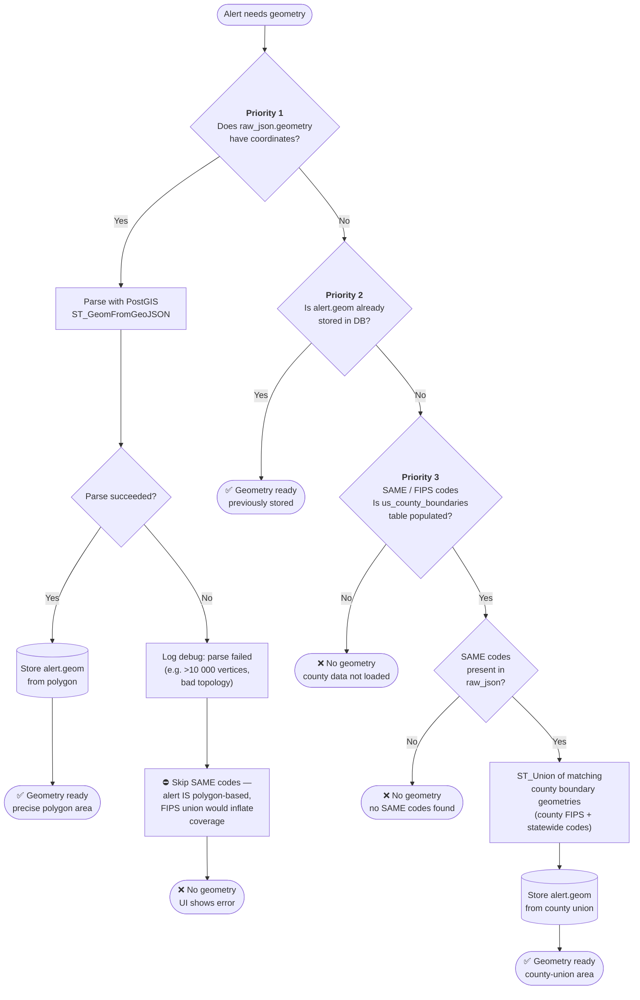
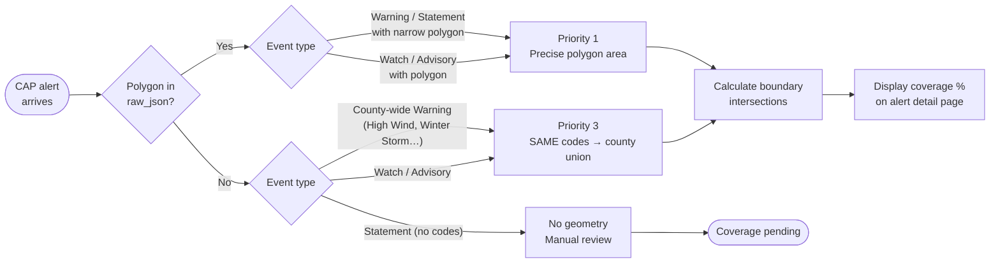
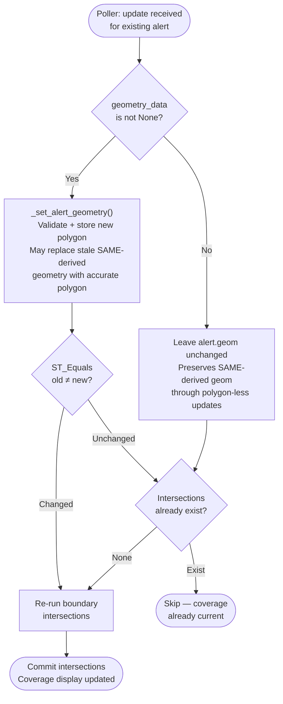
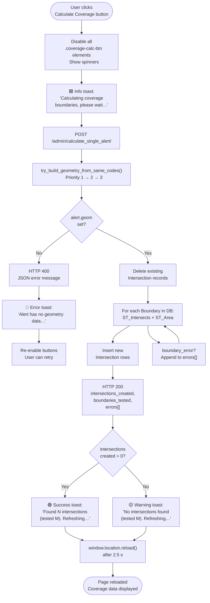
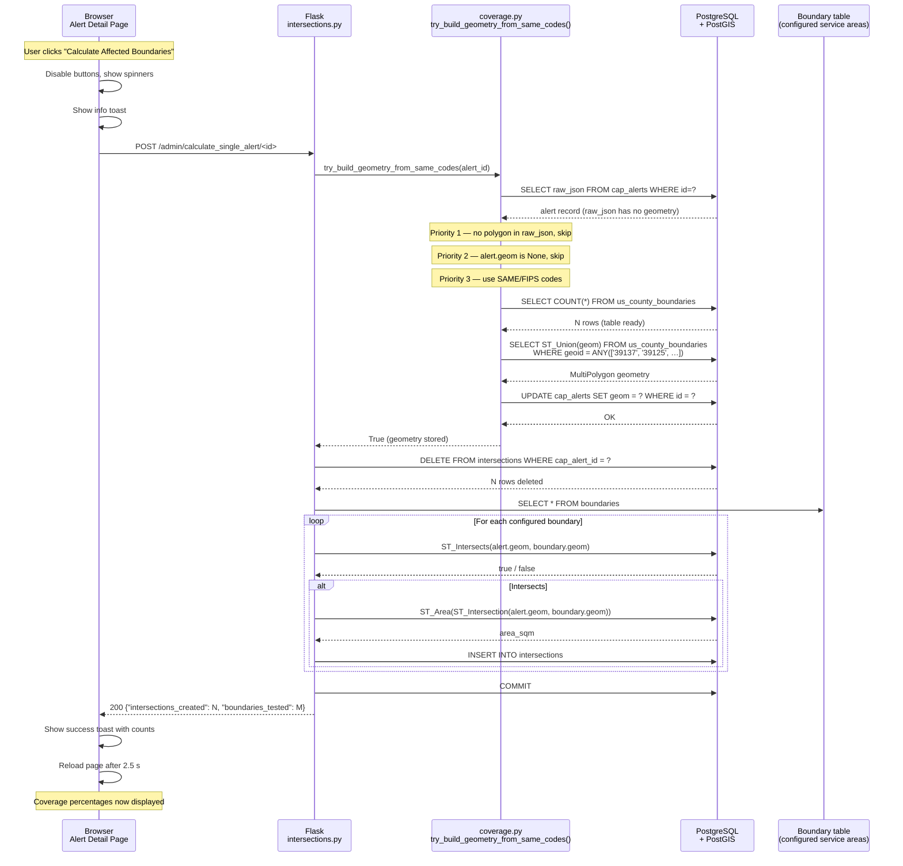

# Alert Geometry and Coverage Calculation

This document explains how EAS Station resolves spatial geometry for incoming CAP
alerts and calculates coverage percentages against configured emergency-service
boundaries.

## Document Overview

**Purpose:** Describe the geometry resolution priority chain, per-type routing
rules, poll-cycle preservation, and the "Calculate Coverage" UI flow

**Audience:** Developers, system operators, and contributors working on spatial
alert processing

**Key files:**
- `webapp/admin/coverage.py` — `try_build_geometry_from_same_codes()`
- `poller/cap_poller.py` — `_update_existing_alert()`, `_set_alert_geometry()`
- `webapp/admin/intersections.py` — `/admin/calculate_single_alert/<id>` route
- `templates/alert_detail.html` — `triggerIntersectionFix()` JS function

---

## Table of Contents

1. [Geometry Resolution Priority Chain](#1-geometry-resolution-priority-chain)
2. [Alert Type Routing](#2-alert-type-routing)
3. [Poll-Cycle Geometry Preservation](#3-poll-cycle-geometry-preservation)
4. [Calculate Coverage Button Flow](#4-calculate-coverage-button-flow)
5. [End-to-End Coverage Calculation Sequence](#5-end-to-end-coverage-calculation-sequence)

---

## 1. Geometry Resolution Priority Chain

When an alert is ingested or when the admin triggers a coverage calculation,
the system resolves geometry through a strict three-level priority chain.
Polygon geometry is always preferred because it represents the real, precise
affected area.  SAME/FIPS codes are a fallback that produces a coarse
full-county union and is appropriate only for county-wide alerts that carry
no polygon.

> **Why Priority 1 failures block Priority 3:**
> If `raw_json['geometry']` has coordinates, the NWS issued a specific polygon
> for the event (e.g. a thunderstorm warning covering part of one county).
> Falling back to the full-county union from FIPS codes would report near-100%
> county coverage for an alert that only clips one corner.  The correct behaviour
> is to surface the parse failure so an operator can investigate.

---

## 2. Alert Type Routing

Different NWS product types reliably contain (or lack) polygon geometry.
The table below shows which priority path is normally taken.

| Alert type | Geometry in feed? | Priority taken | Notes |
|---|---|---|---|
| Tornado Warning | ✅ Polygon | **1** | Precise warned area polygon |
| Severe Thunderstorm Warning | ✅ Polygon | **1** | Storm-cell tracking polygon |
| Flash Flood Warning | ✅ Polygon | **1** | Basin/watershed polygon |
| Tornado Watch | ❌ SAME codes only | **3** | Box covers multiple counties |
| Severe Thunderstorm Watch | ❌ SAME codes only | **3** | Box covers multiple counties |
| High Wind Warning | ❌ SAME codes only | **3** | County-wide, no polygon |
| Winter Storm Warning | ❌ SAME codes only | **3** | County-wide, no polygon |
| Blizzard Warning | ❌ SAME codes only | **3** | County-wide, no polygon |
| Flood Watch | ❌ SAME codes only | **3** | County-wide or multi-county |
| Winter Weather Advisory | ❌ SAME codes only | **3** | County-wide, no polygon |
| Special Weather Statement | Sometimes | **1** or **3** | Depends on NWS office |
| Air Quality Alert | ❌ SAME codes only | **3** | County-wide |
| Extreme Heat Warning | ❌ SAME codes only | **3** | County-wide |

The flowchart below summarises the decision the system makes at ingest time:

---

## 3. Poll-Cycle Geometry Preservation

The CAP poller fetches fresh alert data every few minutes.  For alerts that
carry no polygon (watches, advisories, county-wide warnings), every update
returns `geometry_data = None`.  Before the fix this wiped any SAME-derived
geometry on each poll, causing the admin dashboard to show "Coverage Pending"
again seconds after a successful calculation.

The fix: `_update_existing_alert` only calls `_set_alert_geometry` when the
feed provides actual polygon data.  When `geometry_data is None`, existing
geometry — whether polygon-derived or SAME-derived — is left untouched.

---

## 4. Calculate Coverage Button Flow

The **Calculate Coverage** / **Calculate Affected Boundaries** button on the
Alert Detail page calls `POST /admin/calculate_single_alert/<id>`.  It uses
the same three-priority geometry chain, then runs boundary intersection
calculations and reloads the page when done.

---

## 5. End-to-End Coverage Calculation Sequence

This sequence diagram shows all participants from the browser through the
Flask app, PostGIS, and back, for the common case of a county-wide alert
(e.g. High Wind Warning) with no polygon geometry.

---

## Related Documentation

- **[Data Flow Sequences](DATA_FLOW_SEQUENCES.md)** — Complete CAP alert ingest pipeline
- **[System Architecture](SYSTEM_ARCHITECTURE.md)** — High-level component overview
- **[`webapp/admin/coverage.py`](../../webapp/admin/coverage.py)** — Geometry resolution implementation
- **[`poller/cap_poller.py`](../../poller/cap_poller.py)** — Poll-cycle geometry preservation

---

**Last Updated:** 2026-03-27
