# Display System Architecture

This document provides comprehensive architectural diagrams for the EAS Station display system, including OLED/VFD/LED screen management, the visual editor, and real-time preview functionality.

---

## Table of Contents

1. [OLED Display Preview System](#oled-display-preview-system)
2. [OLED Scrolling Performance Architecture](#oled-scrolling-performance-architecture)
3. [Visual Screen Editor Architecture](#visual-screen-editor-architecture)
4. [Screen Rendering Pipeline](#screen-rendering-pipeline)
5. [Display Manager Workflow](#display-manager-workflow)

---

## OLED Display Preview System

### Overview
The OLED preview system captures actual pixel data from the OLED controller and streams it to the web UI for real-time visualization.

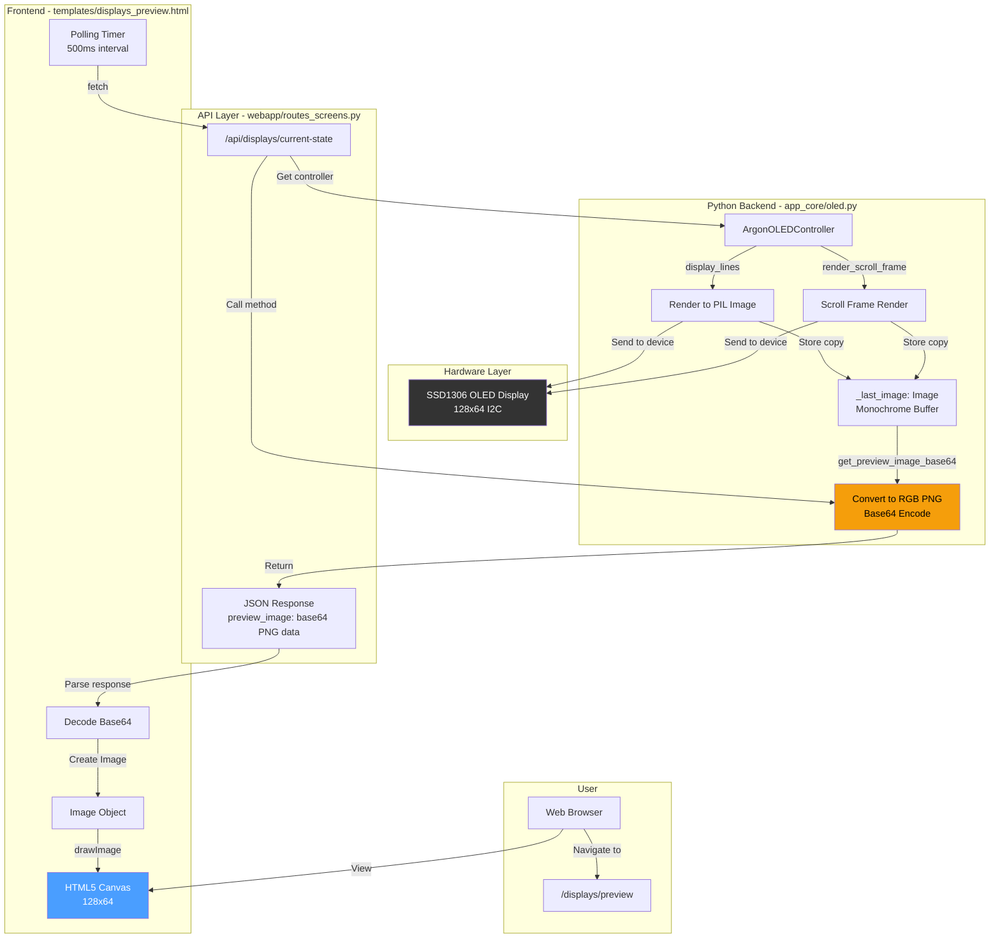

### Data Flow

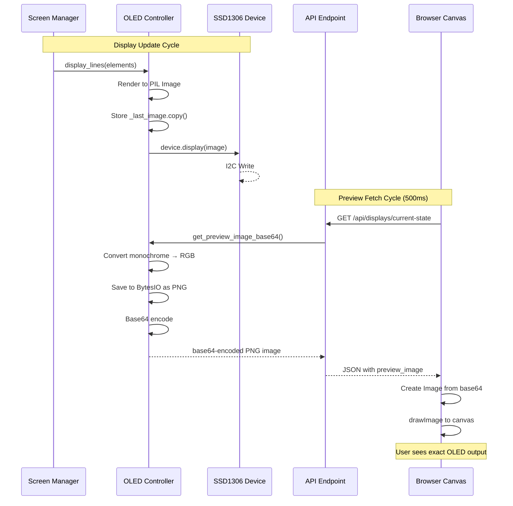

---

## OLED Scrolling Performance Architecture

### Smooth Scrolling System

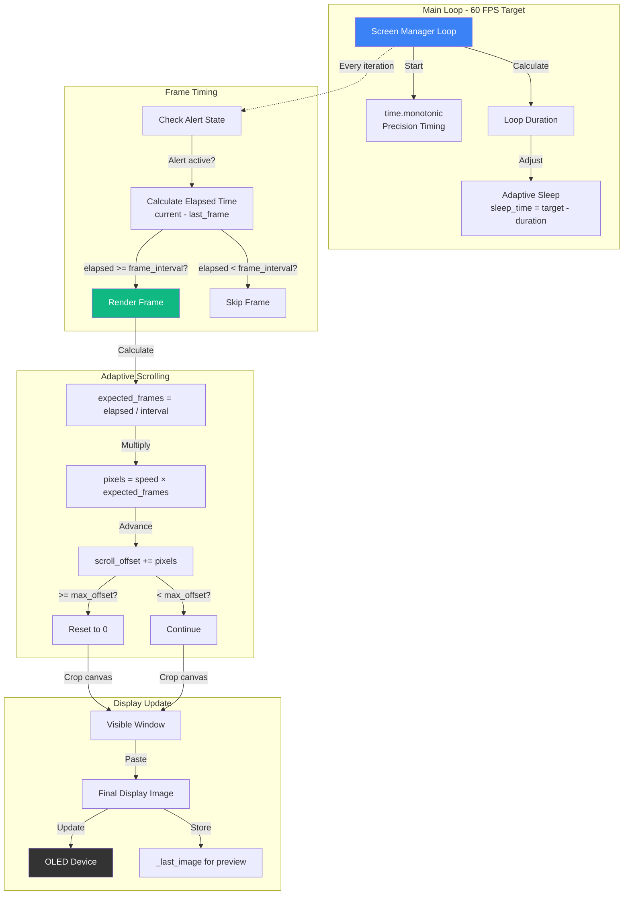

### Timing Precision Improvements

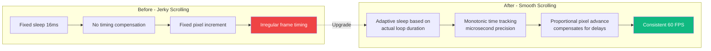

### Seamless Loop Algorithm

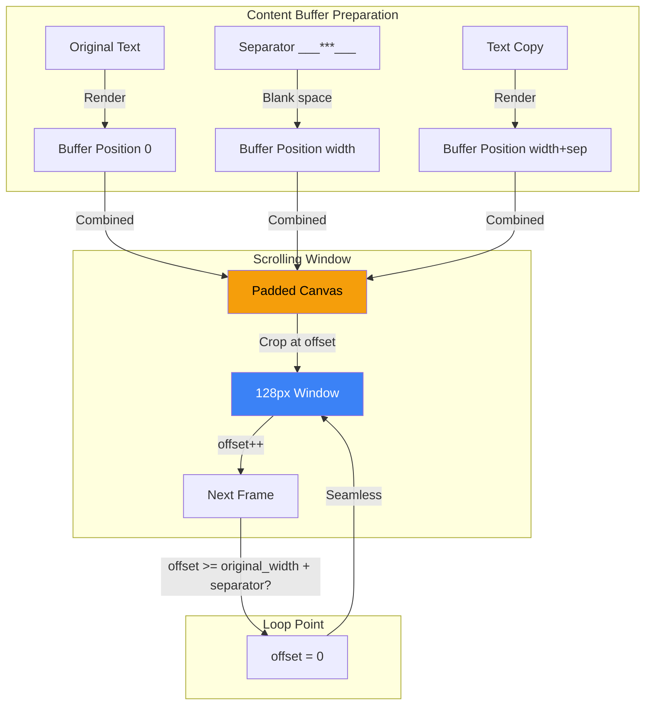

---

## Visual Screen Editor Architecture

### Editor Component Structure

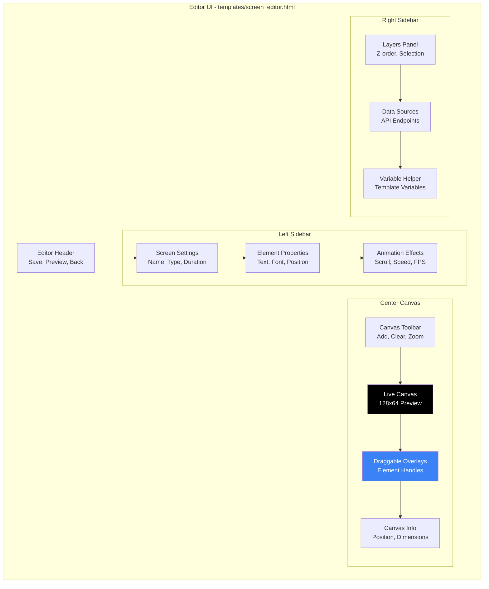

### Editor State Management

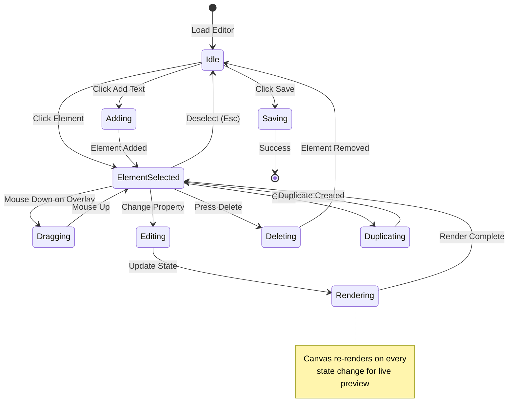

### Data Binding Flow

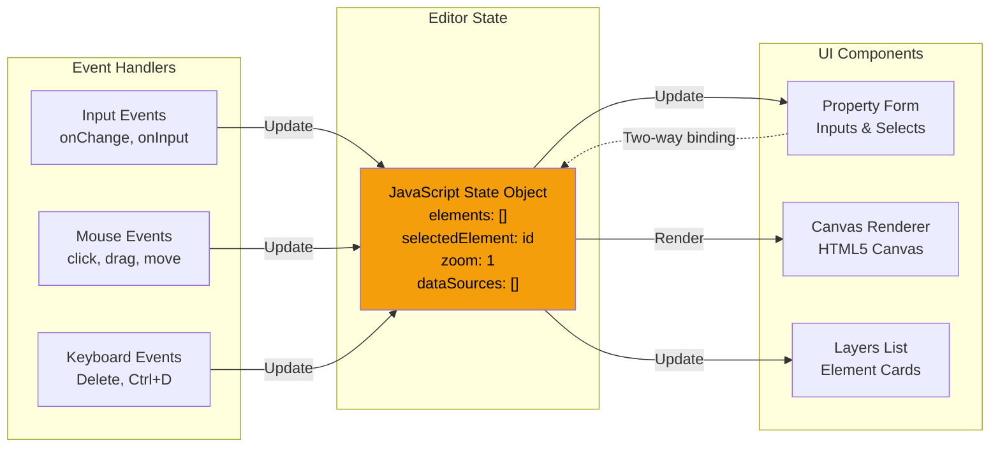

---

## Screen Rendering Pipeline

### Template to Display Flow

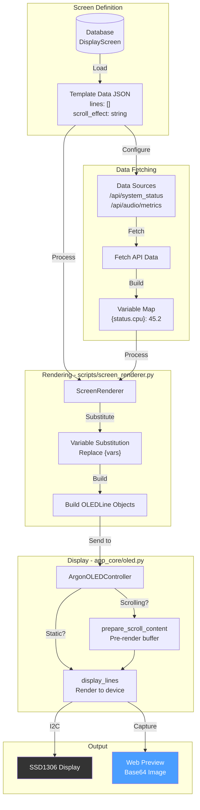

### Variable Substitution Engine

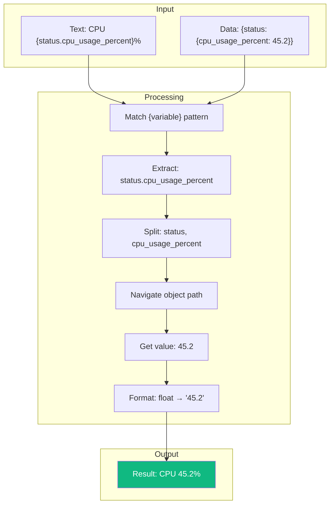

---

## Display Manager Workflow

### Screen Rotation System

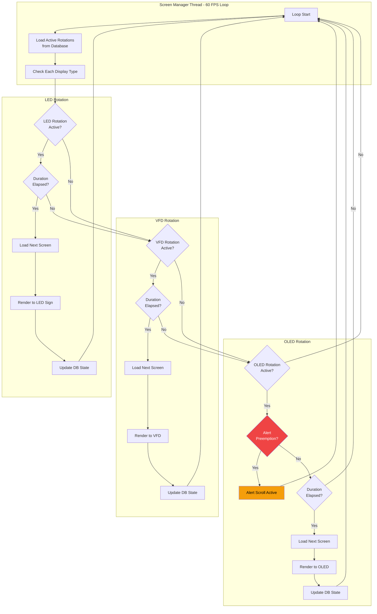

### Alert Preemption Flow

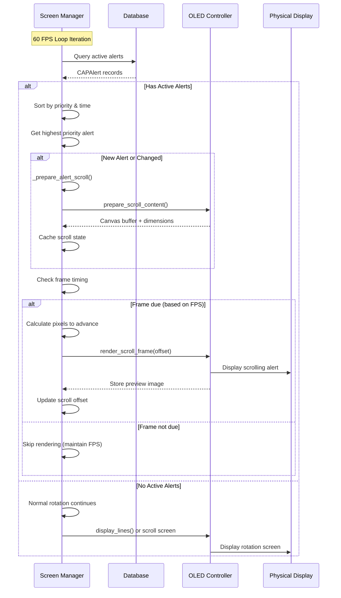

---

## Integration Points

### Visual Editor to Display Flow

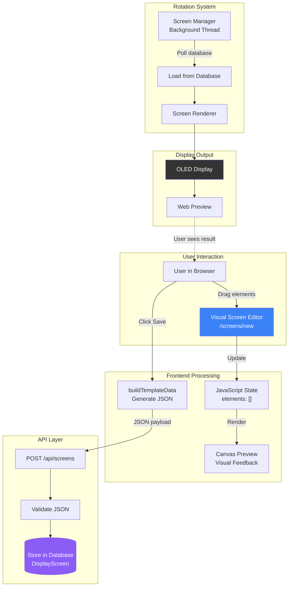

---

## Performance Characteristics

### Frame Timing Analysis

```mermaid
gantt
    title OLED Scrolling Performance - 60 FPS Target
    dateFormat X
    axisFormat %L ms

    section Before (Jerky)
    Frame 1 :f1, 0, 16
    Processing :p1, 16, 20
    Sleep 16ms :s1, 20, 36
    Frame 2 :f2, 36, 52
    Inconsistent timing :crit, 52, 70

    section After (Smooth)
    Frame 1 :done, 100, 116
    Processing :done, 116, 119
    Adaptive Sleep 13ms :done, 119, 132
    Frame 2 :done, 132, 148
    Processing :done, 148, 151
    Adaptive Sleep 13ms :done, 151, 164
    Frame 3 :done, 164, 180
    Consistent 60 FPS :milestone, 180, 0
```

---

## System Metrics

### Display System Overview

| Component | Technology | Performance | Capabilities |
|-----------|-----------|-------------|--------------|
| **OLED Controller** | Python + luma.oled + PIL | 60 FPS scrolling | Monochrome 128x64, I2C, hardware acceleration |
| **Preview System** | Base64 PNG + Canvas | 500ms polling, <50KB per frame | Real-time browser visualization |
| **Visual Editor** | Vanilla JS + Canvas API | Real-time rendering | Drag-drop, layer management, live preview |
| **Screen Manager** | Python threading | 60 FPS loop, <1ms overhead | Multi-display rotation, alert preemption |
| **Variable System** | Regex substitution | <1ms per screen | Dynamic data from 5+ API endpoints |

---

## Architecture Highlights

### Key Innovations

1. **Zero-Copy Preview**: OLED controller stores rendered image once, exports to web without re-rendering
2. **Adaptive Frame Timing**: Scroll speed adjusts to maintain consistent motion despite processing variations
3. **Seamless Looping**: Pre-rendered padded buffer eliminates visible wrap point in scrolling text
4. **Drag-Drop Precision**: Canvas overlays enable pixel-perfect element positioning
5. **JSON Bridge**: Visual editor generates same JSON structure as manual entry for full compatibility

### Design Principles

- **Performance First**: 60 FPS target with microsecond-precision timing
- **User Experience**: Visual tools eliminate JSON editing errors
- **Backward Compatible**: All changes work with existing screens and hardware
- **Scalable**: Architecture supports future display types (e-ink, matrix, etc.)
- **Observable**: Real-time preview enables debugging and validation

---

## Future Enhancements

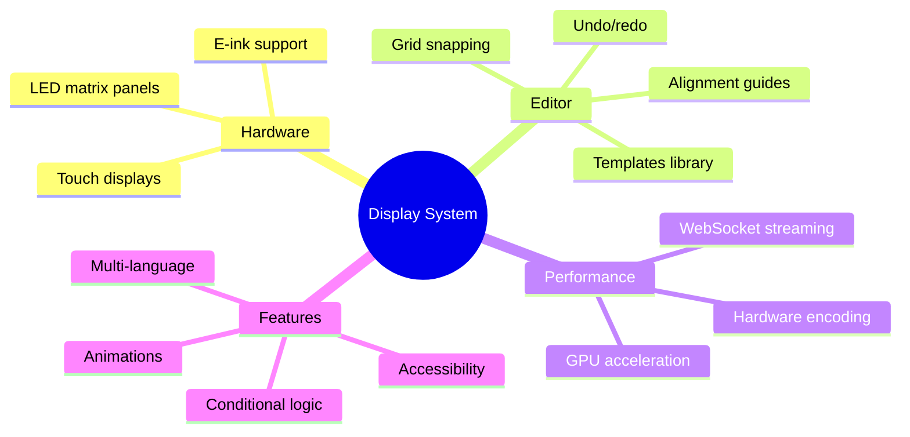

---

**Document Version**: 1.0
**Last Updated**: 2025-11-17
**Author**: KR8MER with Claude AI
**Related Files**:
- `app_core/oled.py` - OLED controller implementation
- `scripts/screen_manager.py` - Display rotation manager
- `templates/screen_editor.html` - Visual editor UI
- `static/js/screen-editor.js` - Editor logic
- `webapp/routes_screens.py` - API routes
