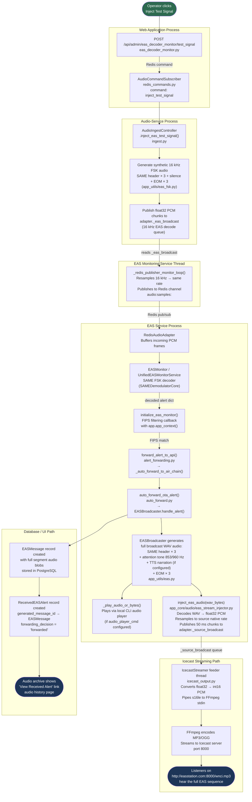

# EAS Test Signal Injection — Pipeline Reference

**File:** `docs/audio/EAS_TEST_SIGNAL_PIPELINE.md`
**Related code:** `app_core/audio/ingest.py` · `app_core/audio/eas_stream_injector.py` · `app_utils/eas.py` · `webapp/admin/eas_decoder_monitor.py`

---

## Purpose

The **Inject Test Signal** button (Monitor → EAS Decoder Monitor → Inject Test Signal) is an
**end-to-end pipeline verification tool**.  Its purpose is to confirm that the complete chain
from *receiving a SAME broadcast over the air* through to *listeners hearing the EAS sequence on
the Icecast stream* is fully operational — **without needing live RF equipment, a real broadcast
station, or an active emergency alert**.

It answers the operator's question:

> *"If a real EAS alert were transmitted right now on the monitored source,
> would my station decode it, rebroadcast it, and would listeners hear it?"*

---

## What "inject test signal" simulates

A real over-the-air EAS event arrives as audio on a monitored stream source
(e.g., `WJON/TV`).  The injector generates that audio synthetically and feeds it
directly into the SAME decoder, bypassing the need for actual RF.  Everything
downstream runs exactly as it would for a live alert.

The injected signal is a standards-compliant **Required Weekly Test (RWT)**:

```
ZCZC-EAS-RWT-000000+0015-<julian-day><HHMM>-EASTEST-
```

followed by three EOM (`NNNN`) bursts — satisfying the FCC §11.31 SAME
format so the decoder recognises it as a real alert type.

---

## Full pipeline flowchart



---

## Step-by-step breakdown

| Step | Where | What happens |
|------|--------|--------------|
| 1 | Browser / Web UI | Operator clicks **Inject Test Signal** |
| 2 | `eas_decoder_monitor.py` | HTTP POST received; publishes `inject_test_signal` command to Redis |
| 3 | `redis_commands.py` (audio-service) | `AudioCommandSubscriber` picks up the command |
| 4 | `ingest.py` | `inject_eas_test_signal()` generates 16 kHz synthetic FSK SAME+EOM audio |
| 5 | `ingest.py` | Publishes float32 PCM chunks to `adapter._eas_broadcast` (16 kHz EAS decode queue) |
| 6 | `eas_monitoring_service.py` | `_redis_publisher_monitor_loop()` reads the decode queue and republishes over Redis (`audio:samples:<source>`) |
| 7 | `eas_service.py` | `RedisAudioAdapter` buffers the incoming PCM; `EASMonitor` SAME decoder processes it |
| 8 | `eas_service.py` | Decoder fires alert callback; FIPS filtering runs inside Flask app context |
| 9 | `alert_forwarding.py` | `forward_alert_to_api()` → `_auto_forward_to_air_chain()` → `auto_forward_ota_alert()` |
| 10 | `app_utils/eas.py` | `EASBroadcaster.handle_alert()` generates the **complete broadcast WAV**: SAME headers × 3 + attention tone (853/960 Hz) + optional TTS narration + EOM × 3 |
| 11 | `app_utils/eas.py` | `_play_audio_or_bytes()` plays audio via local CLI player (if `audio_player_cmd` is configured) |
| 12 | `eas_stream_injector.py` | `inject_eas_audio(wav_bytes)` decodes WAV, resamples to each source's native rate, publishes 50 ms chunks to `adapter._source_broadcast` |
| 13 | `icecast_output.py` | `IcecastStreamer` feeder thread reads `_source_broadcast`, converts float32 → int16 PCM, writes s16le to FFmpeg stdin |
| 14 | FFmpeg / Icecast | Audio encoded as MP3/OGG and streamed to Icecast server on port 8000 |
| 15 | Stream listeners | Hear the full EAS alert sequence on `http://easstation.com:8000/wnci.mp3` |
| 16 | PostgreSQL | `EASMessage` and `ReceivedEASAlert` records saved; Audio Archive shows **View Received Alert** |

---

## Two separate audio queues — why they exist

The system uses two distinct audio queues with different purposes:

| Queue | Field | Rate | Consumers | Purpose |
|-------|-------|------|-----------|---------|
| **EAS decode queue** | `adapter._eas_broadcast` | 16 kHz | SAME decoder (eas_service.py) | Carries resampled audio for FSK demodulation only |
| **Source broadcast queue** | `adapter._source_broadcast` | Native (e.g., 44100 Hz) | IcecastStreamer | Carries full-quality audio for stream output |

`inject_eas_test_signal()` writes to the **decode queue** — simulating raw received audio.
`inject_eas_audio()` writes to the **source broadcast queue** — delivering the generated
broadcast audio to stream listeners.

Both queues must function correctly for the full pipeline to work.

---

## What the test confirms when it passes

When the test signal is injected and audio appears in the Icecast stream, the following
components have all been verified as operational:

- ✅ FSK audio generation (`app_utils/eas_fsk.py`)
- ✅ EAS decode queue routing (`adapter._eas_broadcast`)
- ✅ Redis audio transport between services (`audio:samples:<source>`)
- ✅ SAME FSK decoder (`SAMEDemodulatorCore`)
- ✅ Flask app context in alert callback (`eas_service.py`)
- ✅ FIPS filtering logic (`eas_monitor.py`)
- ✅ `EASBroadcaster` audio generation pipeline (`app_utils/eas.py`)
- ✅ EAS stream injector resampling and queue publish (`eas_stream_injector.py`)
- ✅ Icecast broadcast queue routing (`adapter._source_broadcast`)
- ✅ IcecastStreamer FFmpeg encoder + connection to Icecast server
- ✅ Database records saved (`EASMessage`, `ReceivedEASAlert`)

---

## What the test does NOT verify

- ❌ Actual RF signal reception quality from physical hardware
- ❌ Audio source (e.g., WJON/TV) is running or producing audio
- ❌ Local speaker/transmitter output (separate from the Icecast stream path)
- ❌ GPIO relay activation (requires hardware)
- ❌ IPAWS/CAP alert ingestion (separate pipeline — see `docs/architecture/DATA_FLOW_SEQUENCES.md`)

---

## Failure modes

If the test appears to succeed (API returns 200) but **no audio is heard** in the stream,
check each step in order:

1. **No running audio source** — `inject_eas_test_signal()` requires at least one running source; if none exists, it logs a warning and returns `None`. Verify sources at **Monitor → Audio Sources**.
2. **FIPS filtering blocked the alert** — The generated RWT uses FIPS `000000` (all-county wildcard). If your station has FIPS codes configured that don't match, the alert is ignored. Check **Settings → EAS Configuration → FIPS Codes**.
3. **No Flask app context** — The FIPS callback in `eas_service.py` must run inside `with app.app_context()`. Missing context causes silent alert drops. See `eas_service.py:178`.
4. **`EASBroadcaster` not configured** — If EAS broadcasting is disabled (`eas_config['enabled'] == False`), `handle_alert()` returns immediately without generating audio.
5. **Icecast not connected** — The `IcecastStreamer` may have lost its connection to the Icecast server. Check **Monitor → Icecast Stream** status.
6. **`inject_eas_audio()` has no controller** — The EAS stream injector must have a controller registered at startup. Check that `set_controller()` was called in `_get_audio_controller()`.

---

## Related documentation

- [Audio Monitoring](AUDIO_MONITORING.md) — Audio source configuration
- [Icecast Streaming Setup](../guides/ICECAST_STREAMING_SETUP.md) — Setting up the Icecast server
- [Data Flow Sequences](../architecture/DATA_FLOW_SEQUENCES.md) — CAP/IPAWS alert pipeline
- [EAS Monitor V3 Architecture](../architecture/EAS_MONITOR_V3_ARCHITECTURE.md) — SAME decoder internals
- [EAS Monitors README](../../app_core/audio/README_EAS_MONITORS.md) — Code-level monitor documentation
