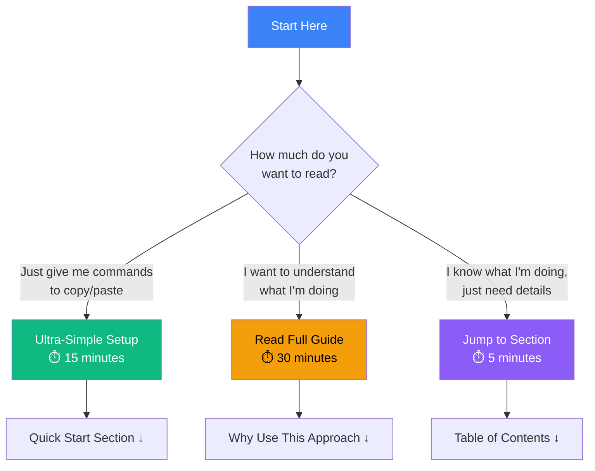

# PyCharm Remote Debugging Guide for Raspberry Pi

**Stop pushing broken code to GitHub!** This guide shows you how to develop and debug the `eas-station` project directly on your Raspberry Pi using PyCharm Professional or VS Code, eliminating the need for constant pull requests during development.

> **💡 Don't have PyCharm Professional?** See [Getting PyCharm Professional for Free](#getting-pycharm-professional-for-free) - the `eas-station` project qualifies for a **free open source license**! Or use the free [VS Code alternative](#ultra-simple-setup-copy--paste) which works just as well.

---

## 🎯 Three Ways to Use This Guide

Choose your path:



**Pick your path:**
1. **🚀 I want to start NOW** → Go to [Ultra-Simple Setup](#ultra-simple-setup-copy--paste) (copy/paste commands)
2. **📚 I want to understand everything** → Read from top to bottom
3. **🔧 I'm experienced, just need specifics** → Use the table of contents below

---

## 📑 Table of Contents

- [Ultra-Simple Setup (Copy & Paste)](#ultra-simple-setup-copy--paste) - Start here if you just want it to work
- [Why Use This Approach?](#why-use-this-approach) - Understand the benefits
- [Which IDE Should You Use?](#which-ide-should-you-use) - PyCharm vs VS Code comparison
- [Getting PyCharm Professional for Free](#getting-pycharm-professional-for-free) - Open source license info
- [Prerequisites](#prerequisites) - What you need
- [Quick Start (5 Steps)](#quick-start-5-steps) - Detailed setup instructions
- [Development Workflow](#development-workflow) - Day-to-day usage
- [Troubleshooting](#troubleshooting) - Fix common problems
- [Best Practices](#best-practices) - Tips for success

---

## Why Use This Approach?

**The Problem**: Making a PR every time you want to test code changes is:
- ⚠️ Slow and frustrating
- ⚠️ Clutters your Git history with broken code
- ⚠️ Makes debugging nearly impossible
- ⚠️ Wastes time with container rebuilds

**The Solution**: Develop and debug live on the Raspberry Pi with:
- ✅ **Real hardware testing** - Test on actual Pi hardware, not simulations
- ✅ **Instant feedback** - See changes immediately without pushing to GitHub
- ✅ **Proper debugging** - Set breakpoints, inspect variables, step through code
- ✅ **Clean Git history** - Only commit working, tested code

---

## Prerequisites

### Required

- **PyCharm Professional Edition** - See [Getting PyCharm for Free](#getting-pycharm-professional-for-free) below
  - Note: Community Edition lacks remote debugging features
- **Raspberry Pi** with:
  - SSH enabled
  - Docker and Docker Compose installed
  - Git installed
  - The `eas-station` repository cloned
- **Local development machine** running Windows, macOS, or Linux
- **Network connection** between your computer and the Raspberry Pi

### Skill Level

This guide assumes you know:
- Basic Python programming
- How to use SSH
- Basic Git commands
- Basic Docker concepts

**Don't worry if you're not an expert!** This guide is designed to be as simple as possible.

---

## Getting PyCharm Professional for Free

PyCharm Professional normally costs money, but you can get it for **free** if you qualify for one of these programs:

### Option 1: Open Source License (Recommended for EAS Station)

Since `eas-station` is an open source project under the AGPL-3.0 license, you may qualify for a free PyCharm Professional license!

**How to apply**:

1. Go to: [JetBrains Open Source License Application](https://www.jetbrains.com/community/opensource/#support)

2. Click **Apply Now**

3. Fill out the form:
   - **Project Name**: EAS Station
   - **Project URL**: `https://github.com/KR8MER/eas-station`
   - **License Type**: AGPL-3.0
   - **Your Role**: Contributor or Maintainer
   - **Project Description**: Emergency Alert System platform for NOAA and IPAWS alerts
   - **Number of Active Contributors**: (check the GitHub repo)
   - **Are you the project lead**: Yes/No (answer honestly)

4. Submit the application

5. JetBrains typically responds within a few days

**Requirements**:
- ✅ Project must be open source with an approved license (EAS Station uses AGPL-3.0 ✓)
- ✅ Project must be actively developed (check!)
- ✅ Project must be non-commercial (check!)
- ✅ Must have been active for 3+ months (check!)

**License Details**:
- Free for 1 year
- Can be renewed annually if still actively contributing
- Covers all JetBrains IDEs (PyCharm, IntelliJ, etc.)

### Option 2: Student License

If you're a student:

1. Go to: [JetBrains Student License](https://www.jetbrains.com/community/education/#students)
2. Verify with your `.edu` email or student ID
3. Get free access to all JetBrains products

### Option 3: 30-Day Free Trial

While waiting for your open source license approval:

1. Download PyCharm Professional: [jetbrains.com/pycharm/download](https://www.jetbrains.com/pycharm/download/)
2. Start a 30-day free trial
3. This gives you time to test everything while your application is processed

### Option 4: Use VS Code (Free Alternative)

If you can't get PyCharm Professional, **VS Code** is a free alternative that also supports remote debugging:

**VS Code Setup** (Quick Version):

1. Install [VS Code](https://code.visualstudio.com/)
2. Install the **Python** extension
3. Install the **Remote - SSH** extension
4. Press `F1` → **Remote-SSH: Connect to Host**
5. Enter `pi@192.168.1.100` (your Pi's IP)
6. VS Code will connect and you can edit files directly on the Pi
7. For debugging, create a `.vscode/launch.json` file:

```json
{
    "version": "0.2.0",
    "configurations": [
        {
            "name": "Python: Remote Attach",
            "type": "python",
            "request": "attach",
            "connect": {
                "host": "192.168.1.100",
                "port": 5678
            },
            "pathMappings": [
                {
                    "localRoot": "${workspaceFolder}",
                    "remoteRoot": "/home/pi/eas-station"
                }
            ]
        }
    ]
}
```

**The rest of this guide works the same with VS Code!** The debugging concepts and Docker setup are identical.

---

## Ultra-Simple Setup (Copy & Paste)

**Feeling overwhelmed?** Here's the absolute simplest path - just copy and paste these commands. No thinking required.

### Part 1: On Your Raspberry Pi (5 minutes)

Connect to your Pi with keyboard and monitor, or SSH if you already have it working.

**Step 1**: Copy and paste this entire block:

```bash
# Enable SSH
sudo systemctl enable ssh
sudo systemctl start ssh

# Show your IP address (write it down!)
echo "======================================"
echo "YOUR PI'S IP ADDRESS IS:"
hostname -I
echo "======================================"
echo "Write down the first IP address!"
```

**Write down that IP address!** You'll need it in a minute.

**Step 2**: Install Docker (copy and paste this whole thing):

```bash
# Install Docker
curl -fsSL https://get.docker.com -o get-docker.sh
sudo sh get-docker.sh

# Let your user run Docker without sudo
sudo usermod -aG docker $USER

# Install Docker Compose
sudo apt-get update
sudo apt-get install -y libffi-dev libssl-dev python3-dev python3-pip
sudo pip3 install docker-compose

# Show versions (verify it worked)
docker --version
docker-compose --version

echo "======================================"
echo "SUCCESS! Docker is installed."
echo "Now log out and log back in."
echo "======================================"
```

**Step 3**: Log out and log back in:

```bash
exit
```

Then SSH back in or reconnect.

**Step 4**: Set up the development environment (copy and paste):

```bash
# Go to your eas-station folder
cd ~/eas-station

# If you don't have it yet, clone it first:
# git clone https://github.com/KR8MER/eas-station.git
# (or your fork: git clone https://github.com/YOUR_USERNAME/eas-station.git)
# cd eas-station

# Copy the development Docker configuration
cp examples/docker-compose/docker-compose.development.yml docker-compose.override.yml

# Copy the example environment file if you don't have one
if [ ! -f .env ]; then
    cp .env.example .env
    echo "Created .env file - using default settings"
fi

# Start everything with the embedded database
docker-compose --profile embedded-db up -d

# Wait a few seconds for containers to start
sleep 10

# Check if it's running
docker-compose ps

echo "======================================"
echo "If you see services running above, YOU'RE DONE with the Pi setup!"
echo "======================================"
```

**That's it for the Pi!** Leave it running and move to your computer.

---

### Part 2: On Your Computer (10 minutes)

#### Option A: VS Code (Recommended - Start Right Now)

**Step 1**: Download and install VS Code:
- Go to: [https://code.visualstudio.com/](https://code.visualstudio.com/)
- Click the big download button
- Install it (just click Next, Next, Next)

**Step 2**: Install the Remote-SSH extension:

1. Open VS Code
2. Click the Extensions icon on the left (looks like blocks) or press `Ctrl+Shift+X`
3. Search for: `Remote - SSH`
4. Click **Install** on the one by Microsoft
5. Also install: `Python` (by Microsoft)

**Step 3**: Connect to your Raspberry Pi:

1. Press `F1` (or `Ctrl+Shift+P` on Windows/Linux, `Cmd+Shift+P` on Mac)
2. Type: `Remote-SSH: Connect to Host`
3. Click it
4. Type: `pi@YOUR.PI.IP.ADDRESS` (use the IP from Part 1)
5. Press Enter
6. Choose "Linux" if asked
7. Enter your Pi password when prompted
8. Wait for VS Code to install the server (happens once, takes ~1 minute)

**Step 4**: Open the project:

1. Click **File** → **Open Folder**
2. Type: `/home/pi/eas-station`
3. Click **OK**
4. Enter password if asked
5. Click **Yes, I trust the authors** if prompted

**Step 5**: Set up debugging:

1. Click the **Run and Debug** icon on the left (looks like a bug with a play button)
2. Click **create a launch.json file**
3. Choose **Python**
4. **Replace everything** in the file with this:

```json
{
    "version": "0.2.0",
    "configurations": [
        {
            "name": "Attach to EAS Station",
            "type": "python",
            "request": "attach",
            "connect": {
                "host": "localhost",
                "port": 5678
            },
            "pathMappings": [
                {
                    "localRoot": "${workspaceFolder}",
                    "remoteRoot": "/app"
                }
            ],
            "justMyCode": false
        }
    ]
}
```

Note: Since you're connected via Remote-SSH, "localhost" refers to the Pi itself, not your local machine.

5. Save the file (`Ctrl+S` or `Cmd+S`)

**Step 6**: Test debugging:

1. Open any Python file (like `app.py`)
2. Click in the left margin next to a line number to set a breakpoint (red dot appears)
3. Click the green **Run** button at the top (or press `F5`)
4. If it connects, **YOU'RE DONE! 🎉**

**You can now edit code and debug directly on your Pi!**

---

#### Option B: PyCharm Professional (If You Have the License)

**Step 1**: Download PyCharm Professional:
- Go to: [https://www.jetbrains.com/pycharm/download/](https://www.jetbrains.com/pycharm/download/)
- Download **Professional** edition (not Community)
- Install it

**Step 2**: Open PyCharm and skip the project screen

**Step 3**: Set up SSH Interpreter:

1. Go to: **File** → **Settings** (Windows/Linux) or **PyCharm** → **Preferences** (Mac)
2. Navigate to: **Project** → **Python Interpreter**
3. Click the **gear icon** ⚙️ → **Add...**
4. Choose **On SSH**
5. Click **New server configuration**
6. Fill in:
   - **Host**: Your Pi's IP address (from Part 1)
   - **Port**: `22`
   - **Username**: `pi`
7. Click **Next**
8. Choose **Password** and enter your Pi password
9. Click **Next**
10. Set interpreter: `/usr/bin/python3`
11. Set sync folders:
    - Local: `<wherever you want to store files locally>`
    - Remote: `/home/pi/eas-station`
12. Click **Finish**
13. Wait for sync (takes a minute)

**Step 4**: Create Debug Configuration:

1. Go to: **Run** → **Edit Configurations...**
2. Click **+** → **Python Debug Server**
3. Name it: `EAS Station Debug`
4. Host: Your Pi's IP
5. Port: `5678`
6. Click **OK**

**Step 5**: Start debugging:

1. Set a breakpoint (click in left margin)
2. Click the debug icon (green bug) or press `Shift+F9`
3. **YOU'RE DONE! 🎉**

---

### Quick Troubleshooting

**"Connection refused"**:
```bash
# On your Pi
docker-compose restart app
docker-compose logs app
```

**"Can't connect to Pi"**:
```bash
# On your Pi
sudo systemctl status ssh
# If not running:
sudo systemctl start ssh
```

**"Permission denied"**:
```bash
# On your Pi
sudo usermod -aG docker,audio,gpio $USER
exit
# Then log back in
```

**Still stuck?** Skip to the [Detailed Instructions](#which-ide-should-you-use) below or [ask for help](https://github.com/KR8MER/eas-station/issues).

---

## Which IDE Should You Use?

### TL;DR Recommendation

**For EAS Station development, I recommend: VS Code (free) while you wait for your PyCharm open source license.**

Here's why:

### Recommended: VS Code (Always Free)

**Best for**:
- ✅ You want to start debugging TODAY (no license wait)
- ✅ You're on a budget or can't get PyCharm license
- ✅ You prefer lightweight, fast tools
- ✅ You work with multiple languages (JavaScript, YAML, Bash, etc.)

**Pros**:
- **Free forever** - No license applications needed
- **Fast and lightweight** - Starts in seconds
- **Excellent remote SSH support** - Works great with Raspberry Pi
- **Great Python support** - With the Python extension
- **Active community** - Tons of extensions and support
- **Works on everything** - Windows, Mac, Linux, even web browser
- **Great Docker integration** - Built-in Docker extension

**Cons**:
- Not quite as polished for pure Python as PyCharm
- Requires installing extensions (but they're free)
- Code completion slightly less sophisticated than PyCharm

### Alternative: PyCharm Professional (Free with OSS License)

**Best for**:
- ✅ You primarily write Python code
- ✅ You want the absolute best Python IDE
- ✅ You're willing to wait a few days for license approval
- ✅ You want advanced refactoring tools

**Pros**:
- **Best-in-class Python IDE** - Nothing beats PyCharm for pure Python
- **Excellent debugging** - Slightly better debugger UI
- **Powerful refactoring** - Rename variables across entire project safely
- **Smart code completion** - Very intelligent autocomplete
- **Database tools built-in** - Direct PostgreSQL access
- **Professional support** - JetBrains backing

**Cons**:
- Requires open source license application (wait time: 2-7 days typically)
- Heavier/slower than VS Code (uses more RAM)
- Less good for non-Python files (YAML, Bash, etc.)

### Don't Consider: PyCharm Community Edition

**Why not?**
- ❌ No remote SSH development
- ❌ No remote debugging
- ❌ No Docker integration

These are the exact features you need for this workflow! Community Edition won't work.

---

## My Honest Recommendation for You

If you're waiting for a PyCharm license or unsure which to choose:

1. **Start with VS Code RIGHT NOW** 
   - You can be debugging on your Pi in 30 minutes
   - It's free forever, no strings attached
   - It works great for this project

2. **Apply for PyCharm OSS license in parallel**
   - Takes 5 minutes to apply
   - Usually approved within a week
   - Once approved, you can switch if you prefer

3. **Try both, pick your favorite**
   - VS Code: Fast, free, works everywhere
   - PyCharm Pro: More Python-focused features
   - Both work perfectly for this project!

**The most important thing**: Stop making PRs to test code! Use either IDE to debug on the Pi directly. Your Git history will thank you.

---

## Detailed Feature Comparison

| Feature | VS Code | PyCharm Pro | PyCharm Community |
|---------|---------|-------------|-------------------|
| **Remote Development** | | | |
| SSH to Raspberry Pi | ✅ Excellent | ✅ Excellent | ❌ No |
| Edit files on Pi | ✅ Yes | ✅ Yes | ❌ No |
| Remote debugging | ✅ Yes (debugpy) | ✅ Yes (debugpy) | ❌ No |
| Port forwarding | ✅ Built-in | ✅ Built-in | ❌ No |
| **Python Features** | | | |
| Code completion | ✅ Very Good | ✅ Excellent | ✅ Very Good |
| Linting (pylint, flake8) | ✅ Yes | ✅ Yes | ✅ Yes |
| Type checking | ✅ Yes (mypy) | ✅ Yes | ✅ Yes |
| Refactoring | ✅ Good | ✅ Excellent | ✅ Good |
| Test runner | ✅ Yes (pytest) | ✅ Yes | ✅ Yes |
| Virtual env support | ✅ Yes | ✅ Yes | ✅ Yes |
| **Debugging** | | | |
| Breakpoints | ✅ Yes | ✅ Yes | ✅ Local only |
| Variable inspection | ✅ Yes | ✅ Yes | ✅ Local only |
| Watch expressions | ✅ Yes | ✅ Yes | ✅ Local only |
| Step through code | ✅ Yes | ✅ Yes | ✅ Local only |
| Remote attach | ✅ Yes | ✅ Yes | ❌ No |
| **Docker Support** | | | |
| Dockerfile syntax | ✅ Yes | ✅ Yes | ✅ Basic |
| Compose file support | ✅ Yes | ✅ Yes | ✅ Basic |
| Container management | ✅ Yes (extension) | ✅ Yes | ❌ Limited |
| Exec into container | ✅ Yes | ✅ Yes | ❌ No |
| **Other Languages** | | | |
| JavaScript/HTML/CSS | ✅ Excellent | ✅ Good | ✅ Basic |
| Bash/Shell | ✅ Excellent | ✅ Good | ✅ Basic |
| YAML | ✅ Excellent | ✅ Good | ✅ Basic |
| Markdown | ✅ Excellent | ✅ Good | ✅ Good |
| **Performance** | | | |
| Startup time | ✅ Fast (1-2s) | ⚠️ Slower (5-10s) | ⚠️ Slower (5-10s) |
| Memory usage | ✅ Low (~300MB) | ⚠️ High (~1GB) | ⚠️ High (~1GB) |
| **Cost** | | | |
| Price | ✅ Free | ✅ Free (OSS)* | ✅ Free |
| License wait | ✅ None | ⚠️ 2-7 days | ✅ None |
| Renewal | ✅ N/A | ⚠️ Yearly | ✅ N/A |

*OSS = Open Source Software license from JetBrains

---

## Real Talk: What I Would Do

If I were you, here's exactly what I'd do:

**Right now (next 30 minutes)**:
1. Install VS Code
2. Install Remote-SSH extension
3. Connect to your Pi
4. Start debugging
5. **Stop making PRs just to test code!**

**This evening (5 minutes)**:
1. Apply for PyCharm OSS license
2. Mention you're contributing to EAS Station (open source, AGPL-3.0)
3. Wait for approval email

**Next week (when license arrives)**:
1. Install PyCharm Professional
2. Try it out for a few days
3. Compare with VS Code
4. Use whichever you like better

**Bottom line**: Both are excellent. VS Code gets you started immediately. PyCharm Pro is slightly nicer for Python once you have the license. You can't go wrong with either choice.

The real win is debugging on the Pi instead of the GitHub PR cycle!

---

## Quick Start (5 Steps)

### Step 1: Enable SSH on Raspberry Pi

1. Connect to your Raspberry Pi (keyboard + monitor, or existing SSH session)

2. Enable and start SSH:
```bash
sudo systemctl enable ssh
sudo systemctl start ssh
```

3. Find your Pi's IP address:
```bash
hostname -I
```

**Write down the IP address** (example: `192.168.1.100`) - you'll need it later.

---

### Step 2: Set Up SSH Remote Interpreter in PyCharm

1. Open PyCharm on your local computer

2. Open or create a project folder for `eas-station`

3. Go to: **File** → **Settings** (or **PyCharm** → **Preferences** on macOS)

4. Navigate to: **Project: eas-station** → **Python Interpreter**

5. Click the **gear icon** ⚙️ → **Add...**

6. Choose **SSH Interpreter**

7. Fill in the connection details:
   - **Host**: Your Pi's IP address (e.g., `192.168.1.100`)
   - **Port**: `22` (default SSH port)
   - **Username**: Your Pi username (usually `pi`)

8. Click **Next**

9. Choose authentication:
   - **Password**: Enter your Pi's password, OR
   - **Key pair**: Select your SSH private key if you use key-based auth

10. Click **Next**

11. Set the interpreter path:
    - **Interpreter**: `/usr/bin/python3` (or the path to Python on your Pi)
    - **Sync folders**: 
      - Local: Your project folder (e.g., `/Users/yourname/projects/eas-station`)
      - Remote: `/home/pi/eas-station`

12. Click **Finish**

PyCharm will now sync your project files to the Raspberry Pi. This may take a minute.

---

### Step 3: Install Docker on Raspberry Pi (If Not Already Installed)

Connect to your Pi via SSH and run:

```bash
# Install Docker
curl -fsSL https://get.docker.com -o get-docker.sh
sudo sh get-docker.sh

# Add your user to the docker group (so you don't need sudo)
sudo usermod -aG docker $USER

# Install Docker Compose
sudo apt-get update
sudo apt-get install -y libffi-dev libssl-dev python3-dev python3-pip
sudo pip3 install docker-compose

# Log out and back in for group changes to take effect
exit
```

After logging back in, verify the installation:

```bash
docker --version
docker-compose --version
```

---

### Step 4: Set Up Development Docker Configuration

The repository includes a special Docker configuration file for development that enables debugging.

On your Raspberry Pi (via SSH):

```bash
cd /home/pi/eas-station

# Copy the development configuration
cp examples/docker-compose/docker-compose.development.yml docker-compose.override.yml

# Start the containers
docker-compose up -d

# Check that services are running
docker-compose ps
```

You should see services starting up. The `app` service will be listening on port 5678 for the debugger.

---

### Step 4b: Configure the Development Database

The development configuration uses a separate PostgreSQL database to keep your development work isolated from any production data. Here's how to configure it:

#### Option 1: Use the Embedded Database (Recommended for Development)

The easiest approach is to use the embedded PostgreSQL container that comes with the development configuration:

```bash
# Make sure you're using the embedded database profile
docker-compose --profile embedded-db up -d alerts-db

# Verify the database is running
docker-compose ps alerts-db
```

The embedded database is automatically configured with these settings (from `docker-compose.development.yml`):
- **Database Name**: `alerts_dev`
- **Username**: `postgres`
- **Password**: `devpassword`
- **Port**: `5432` (exposed on the Pi)

**Important - Hostname depends on where your code runs**:

1. **When running app in Docker container** (normal mode):
   - Use `POSTGRES_HOST=alerts-db` in `.env`
   - This is the Docker service name

2. **When running app directly on Pi via PyCharm debugger** (debugging mode):
   - Use `POSTGRES_HOST=localhost` in `.env`
   - The database port (5432) is exposed to your Pi's localhost
   - ❌ **Do NOT use** `host.docker.internal` - this doesn't work on Linux/Raspberry Pi
   - ✅ Use `localhost` because you're debugging directly on the Pi, not inside a container

#### Option 2: Use an External Database

If you want to use an existing PostgreSQL installation instead of the embedded container:

1. **Edit your `.env` file**:

```bash
# Open the .env file
nano .env

# Update these settings:
POSTGRES_HOST=192.168.1.100  # Your external database server IP (NOT localhost or host.docker.internal)
POSTGRES_PORT=5432
POSTGRES_DB=alerts_dev
POSTGRES_USER=postgres
POSTGRES_PASSWORD=your-secure-password
```

**Important - Hostname depends on your setup**:
- ✅ Use the actual IP address of your database server (e.g., `192.168.1.100`) for external databases
- ✅ Use `localhost` if debugging directly on the Pi with embedded database
- ❌ **Do NOT use** `host.docker.internal` - this doesn't work on Linux/Raspberry Pi

2. **Create the database** (on your PostgreSQL server):

```sql
CREATE DATABASE alerts_dev;
CREATE EXTENSION IF NOT EXISTS postgis;
```

3. **Restart the containers** to apply the new settings:

```bash
docker-compose restart app
```

#### Verifying Database Connection

Test that the application can connect to the database:

```bash
# Check app logs for database connection
docker-compose logs app | grep -i "database\|postgres"

# You should see: "Connected to PostgreSQL" or similar
# If you see connection errors, check your .env file
```

**Common connection issues**:

When **debugging directly on the Pi** (not in Docker):
- ❌ Using `host.docker.internal` → **This doesn't work on Linux!** Change to `localhost` in `.env`
- ❌ Using `alerts-db` → Change to `localhost` in `.env`
- ✅ Correct setting: `POSTGRES_HOST=localhost`

When **running app in Docker container**:
- ❌ Using `localhost` → Change to `alerts-db` in `.env`
- ✅ Correct setting: `POSTGRES_HOST=alerts-db`

#### Remote PyCharm Debugging: Network Architecture

**Understanding the Setup**:

When you debug remotely with PyCharm, you're running Python code **directly on the Pi**, not in a Docker container. PyCharm uses SSH to execute the code on the Pi as if you were sitting at the Pi itself.

```
Your Computer (PyCharm on Windows/Mac/Linux)
    │
    │ SSH Connection
    ↓
Raspberry Pi (Python runs here on host OS)
    │
    │ localhost:5432
    ↓
Docker Container (PostgreSQL)
```

**Key Insight**: Docker's internal network (`alerts-db`) is only accessible from *inside* Docker containers. When PyCharm runs Python on the Pi via SSH, the code runs on the Pi's host OS, not inside Docker, so it must connect to exposed ports on `localhost`.

**Why Docker network names don't work**:
- `alerts-db` only resolves inside the Docker network
- Your PyCharm-executed code runs on the Pi's host OS
- The Pi's host OS is on a different network than Docker's internal bridge network
- Docker exposes ports to the Pi's localhost (e.g., `localhost:5432`) for host access

**Solution for PyCharm SSH Remote Debugging**: Use `POSTGRES_HOST=localhost` because:
1. PyCharm executes your Python code on the Pi via SSH
2. The code runs on the Pi's host OS (not in Docker)
3. Docker exposes the database port (5432) to the Pi's `localhost`
4. Your code connects to `localhost:5432` which forwards to the Docker container

#### Debugging from a Windows/Mac Machine (Outside Docker)

If you're running Python **locally on your Windows/Mac machine** (not via SSH to the Pi), you need to connect to the Pi's IP address:

**Network Setup**:
```
Your Windows/Mac Computer (Python runs here locally)
    │
    │ Network: 192.168.1.x
    ↓
Raspberry Pi (192.168.1.100)
    │
    │ Port 5432 exposed
    ↓
Docker Container (PostgreSQL)
```

**Configuration for local Windows/Mac debugging**:

1. **Find your Pi's IP address** (on the Pi):
   ```bash
   hostname -I
   # Example output: 192.168.1.100
   ```

2. **Verify the database port is exposed** (check `docker-compose.yml`):
   ```yaml
   alerts-db:
     ports:
       - "5432:5432"  # This exposes port 5432 to the network
   ```

3. **In your local `.env` file** (on Windows/Mac):
   ```bash
   POSTGRES_HOST=192.168.1.100  # Your Pi's IP address
   POSTGRES_PORT=5432
   POSTGRES_DB=alerts_dev
   POSTGRES_USER=postgres
   POSTGRES_PASSWORD=devpassword
   ```

4. **Test the connection** (from Windows/Mac):
   ```bash
   # Using psql (if installed):
   psql -h 192.168.1.100 -p 5432 -U postgres -d alerts_dev
   
   # Or test with Python:
   python -c "import psycopg2; psycopg2.connect(host='192.168.1.100', port=5432, user='postgres', password='devpassword', database='alerts_dev'); print('Connected!')"
   ```

**Firewall Note**: Ensure the Pi's firewall allows incoming connections on port 5432:
```bash
# On the Pi, allow PostgreSQL port:
sudo ufw allow 5432/tcp
sudo ufw status
```

**Security Warning**: Exposing PostgreSQL to your local network is acceptable for development, but:
- ❌ Never expose it to the internet
- ❌ Don't use `devpassword` in production
- ✅ Only allow access from trusted local network IPs

#### Switching Between Debugging Modes

You'll need to change `POSTGRES_HOST` depending on how you're running the app:

**Quick Reference**:
```bash
# Edit .env file on your Pi
nano .env

# For PyCharm debugging (running Python directly on Pi):
POSTGRES_HOST=localhost

# For Docker debugging (running inside container):
POSTGRES_HOST=alerts-db
```

**Pro Tip**: You can keep both settings commented in your `.env` file and uncomment the one you need:
```bash
# Uncomment ONE of these based on your debugging mode:
# POSTGRES_HOST=localhost          # For PyCharm direct debugging on Pi
# POSTGRES_HOST=alerts-db          # For running in Docker container
```

#### Important Database Configuration Notes

**For development with embedded database**:
- ✅ Use `alerts_dev` as the database name (not `alerts`)
- ✅ The database is automatically created and migrated on first startup
- ✅ Use `devpassword` for local testing (not secure, only for development)
- ✅ The database port (5432) is exposed to your Pi for debugging and external tools

**Critical: Choose the right hostname for `POSTGRES_HOST` in `.env`**:

- 🔌 **Debugging from Windows/Mac (Python runs on your computer)**: Use `POSTGRES_HOST=192.168.1.100` (your Pi's IP)
  - Python runs locally on your Windows/Mac machine
  - Must connect to the Pi's network IP address
  - Requires port 5432 to be exposed in docker-compose.yml
  - Use Pi's actual IP address, not `localhost` (which would be your own computer)
  
- 🐛 **Debugging via SSH (PyCharm remote interpreter on Pi)**: Use `POSTGRES_HOST=localhost`
  - Python runs on the Pi via SSH (not on your computer)
  - The database container exposes port 5432 to the Pi's localhost
  - ❌ **DO NOT use** `host.docker.internal` - this only works on Docker Desktop, not on Linux/Pi!
  
- 🐳 **Running app in Docker container**: Use `POSTGRES_HOST=alerts-db`
  - Docker services communicate via service names
  - `alerts-db` is the database service name in docker-compose.yml

**For production**:
- ⚠️ Use a strong password (generate with `openssl rand -hex 32`)
- ⚠️ Don't expose port 5432 to the internet
- ⚠️ Use the production `docker-compose.yml` (not the override)
- ⚠️ Set up regular backups

---

### Step 5: Configure PyCharm Debugger

1. In PyCharm, go to: **Run** → **Edit Configurations...**

2. Click the **+** button → **Python Debug Server**

3. Fill in the configuration:
   - **Name**: `EAS Station Remote Debug`
   - **IDE host name**: Your Pi's IP address (e.g., `192.168.1.100`)
   - **Port**: `5678`

4. Click **OK**

5. Set a breakpoint in your code (click in the left margin next to a line number)

6. Click the **Debug** button (green bug icon) or press **Shift+F9**

7. PyCharm will wait for a connection. When your code hits the breakpoint, execution will pause and you can inspect variables!

---

## Development Workflow

Once everything is set up, here's your daily workflow:

### 1. Start Your Day

```bash
# SSH into your Pi
ssh pi@192.168.1.100

# Navigate to the project
cd /home/pi/eas-station

# Make sure containers are running
docker-compose ps

# If not running, start them
docker-compose up -d
```

### 2. Make Changes in PyCharm

- Edit code in PyCharm on your local machine
- PyCharm automatically syncs changes to the Raspberry Pi
- Set breakpoints where you want to inspect code

### 3. Debug Your Code

- Start the PyCharm debugger (Run → Debug 'EAS Station Remote Debug')
- Run or restart the code on the Pi
- When code hits your breakpoint, PyCharm pauses execution
- Inspect variables, step through code, find bugs

### 4. Test on Real Hardware

- Your code is running on actual Raspberry Pi hardware
- Test with real GPIO pins, audio interfaces, SDR receivers
- Verify that everything works as expected

### 5. Commit Only Working Code

```bash
# On your Raspberry Pi
cd /home/pi/eas-station

# Check what changed
git status
git diff

# Stage and commit only tested, working code
git add <files>
git commit -m "Fix: Descriptive message about what you fixed"

# Push to GitHub
git push origin <branch-name>
```

---

## Understanding the Development Docker Configuration

The `docker-compose.development.yml` file configures your environment for debugging:

### Key Features

1. **Debug Port Exposed**: Port 5678 is open for PyCharm to connect
2. **Live Code Reloading**: Your code changes are mounted as volumes
3. **Debug Mode Enabled**: Flask debug mode and verbose logging
4. **Hardware Disabled**: Prevents accidental activation of GPIO/LEDs during dev
5. **Test Audio**: Uses test files instead of real radio input

### What Gets Disabled for Safety

To prevent accidents while debugging, the development config disables:
- EAS broadcast relay (no actual emergency broadcasts during testing!)
- GPIO pins (won't trigger real-world relays)
- LED signs
- VFD displays

### Test Data Instead of Real Data

The development config uses:
- Test audio files (loops of sample EAS tones)
- Longer polling intervals (5 minutes instead of constant)
- Separate development database (won't mess up production data)

---

## Troubleshooting

### Problem: "Connection Refused" When Debugging

**Cause**: The Docker container isn't listening for debugger connections.

**Solution**:
```bash
# Check if the app container is running
docker-compose ps

# Check logs for errors
docker-compose logs app

# Restart the app container
docker-compose restart app
```

---

### Problem: PyCharm Can't Connect via SSH

**Cause**: SSH might not be running, or firewall is blocking it.

**Solution**:
```bash
# On the Pi, check SSH status
sudo systemctl status ssh

# If not running, start it
sudo systemctl start ssh

# Test SSH connection from your computer
ssh pi@192.168.1.100
```

---

### Problem: Code Changes Not Appearing

**Cause**: PyCharm sync might not be working, or Docker volumes aren't mounted.

**Solution**:

1. Check PyCharm's sync status (bottom right corner)
2. Manually trigger sync: **Tools** → **Deployment** → **Sync with Deployed to...**
3. Restart Docker containers:
```bash
docker-compose down
docker-compose up -d
```

---

### Problem: "Permission Denied" on /dev/snd or GPIO

**Cause**: Your user isn't in the correct groups.

**Solution**:
```bash
# Add your user to necessary groups
sudo usermod -aG audio,gpio,docker $USER

# Log out and back in
exit
# (SSH back in)

# Verify group membership
groups
```

---

### Problem: Can't Find Docker Compose

**Cause**: Docker Compose might not be installed or not in PATH.

**Solution**:
```bash
# Try with docker compose (space, not hyphen) - newer syntax
docker compose version

# Or reinstall
sudo pip3 install docker-compose
```

---

## Best Practices

### DO ✅

- **Test locally first**: Always debug on the Pi before pushing to GitHub
- **Use breakpoints**: Don't just add print statements - use real debugging
- **Commit often**: When something works, commit it immediately
- **Write descriptive commits**: Future you will thank you
- **Keep override file local**: Don't commit `docker-compose.override.yml` to Git

### DON'T ❌

- **Don't push untested code**: Test it on the Pi first!
- **Don't commit broken code**: Fix it first, then commit
- **Don't commit debug configurations**: Keep those in override files
- **Don't skip testing**: Just because it "should work" doesn't mean it does
- **Don't commit secrets**: Check for passwords/API keys before committing

---

## Advanced: Debugging Specific Services

### Debugging the Audio Service

```bash
# View logs in real-time
docker-compose logs -f audio_service

# Restart just the audio service
docker-compose restart audio_service
```

### Debugging the Poller Service

```bash
# Check poller logs
docker-compose logs poller

# Run poller manually with debug output
docker-compose run --rm poller python poller/cap_poller.py --debug
```

### Accessing the Database Directly

The development configuration exposes PostgreSQL on port 5432:

```bash
# Connect from your Pi
psql -h localhost -U postgres -d alerts_dev

# Or use a GUI tool like DBeaver or pgAdmin from your computer
# Host: 192.168.1.100
# Port: 5432
# Database: alerts_dev
# Username: postgres
# Password: devpassword (from .env or docker-compose.development.yml)
```

---

## Using pgAdmin for Database Inspection

The development Docker config includes pgAdmin for easy database management.

### Starting pgAdmin

```bash
docker-compose --profile development up -d pgadmin
```

### Accessing pgAdmin

1. Open your web browser
2. Go to: `http://192.168.1.100:5050`
3. Login:
   - Email: `admin@localhost`
   - Password: `admin`

4. Add your database server:
   - Host: `alerts-db`
   - Port: `5432`
   - Database: `alerts_dev`
   - Username: `postgres`
   - Password: `devpassword`

---

## Keeping Your Git History Clean

### Use .gitignore

Make sure these files are NOT committed:

```gitignore
# Development files (should already be in .gitignore)
docker-compose.override.yml
*.log
__pycache__/
.env
dev_data/
```

### Check Before Committing

```bash
# Always check what you're about to commit
git status
git diff

# Only add specific files
git add app.py
git add app_core/alerts.py

# NOT this (adds everything, including junk):
# git add .
```

### Write Good Commit Messages

❌ Bad:
```
git commit -m "fixed stuff"
git commit -m "update"
git commit -m "asdfasdf"
```

✅ Good:
```
git commit -m "Fix: Audio service crash when USB device disconnects"
git commit -m "Add: Retry logic for failed IPAWS poll requests"
git commit -m "Improve: Alert deduplication performance"
```

---

## Summary

You now have a complete development environment where you can:

1. ✅ Edit code in PyCharm on your local machine
2. ✅ Run and debug on real Raspberry Pi hardware
3. ✅ Set breakpoints and inspect variables
4. ✅ Test with actual GPIO, audio, and SDR hardware
5. ✅ Commit only working, tested code to GitHub

**No more broken PRs. No more guess-and-check debugging. No more wasted time.**

---

## Quick Reference Card

### Daily Commands

```bash
# Start debugging session
ssh pi@192.168.1.100
cd /home/pi/eas-station
docker-compose up -d

# Check status
docker-compose ps
docker-compose logs -f app

# Stop debugging session
docker-compose down
```

### PyCharm Shortcuts

- **Set Breakpoint**: Click left margin or `Ctrl+F8` (Windows/Linux) / `Cmd+F8` (Mac)
- **Start Debugging**: `Shift+F9`
- **Step Over**: `F8`
- **Step Into**: `F7`
- **Resume Program**: `F9`
- **Stop Debugging**: `Ctrl+F2` (Windows/Linux) / `Cmd+F2` (Mac)

---

## Getting Help

- **PyCharm Documentation**: [Remote Debugging with PyCharm](https://www.jetbrains.com/help/pycharm/remote-debugging-with-product.html)
- **VS Code Remote SSH**: [VS Code Remote Development](https://code.visualstudio.com/docs/remote/ssh)
- **Docker Compose Docs**: [Docker Compose Overview](https://docs.docker.com/compose/)
- **EAS Station Issues**: [GitHub Issues](https://github.com/KR8MER/eas-station/issues)

---

**Document Version**: 1.0  
**Last Updated**: 2025-12-02  
**Maintained By**: EAS Station Development Team

---

## Document History

This guide was created collaboratively to solve a real development workflow problem experienced by contributors to the EAS Station project. The content and structure reflect actual pain points from debugging on real Raspberry Pi hardware.

**Contributions**:
- Problem identification and requirements: KR8MER
- Initial concept and workflow definition: KR8MER
- Technical implementation and documentation: GitHub Copilot with KR8MER
- Integration with existing documentation: GitHub Copilot
