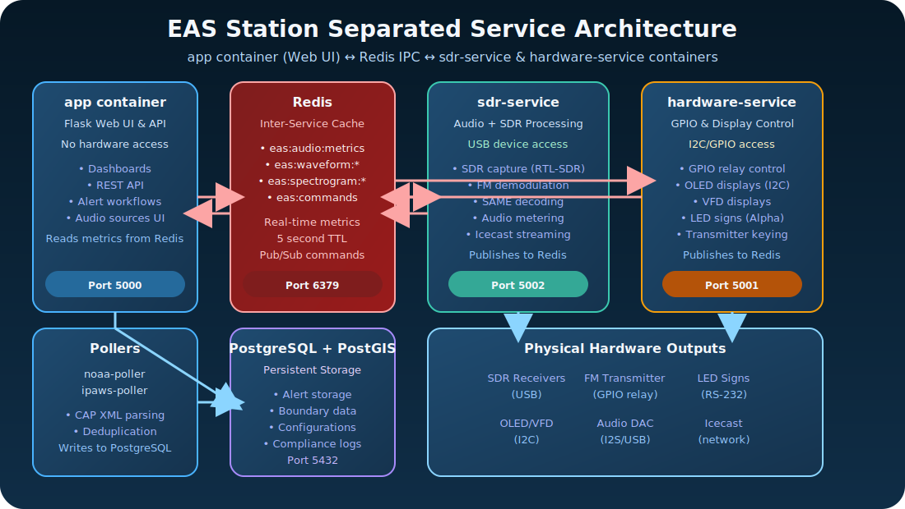

# ℹ️ About EAS Station

EAS Station is a complete Emergency Alert System platform that automates the ingestion, encoding, broadcast, and verification of Common Alerting Protocol (CAP) alerts. Built by amateur radio operators supporting Putnam County, Ohio, it combines NOAA and IPAWS feed aggregation, FCC-compliant SAME encoding, PostGIS spatial intelligence, SDR verification, and LED signage integration into a unified operations hub.

The long-term vision is to deliver a software-driven, off-the-shelf drop-in replacement for commercial encoder/decoder appliances. Every subsystem is being designed so commodity compute, SDR front-ends, and readily available interfaces can fulfill the same mission as the traditional rack units.

EAS Station’s reference build centers on a Raspberry Pi 5 (4 GB RAM baseline, 8 GB recommended when narration and SDR verification share the host) with HATs that expose dry-contact GPIO relays, RS-232 automation ports, and balanced audio interfaces. HDMI confidence monitoring and paired SDR receivers complete the package, proving that inexpensive, fan-less hardware can shoulder the same responsibilities as the utilitarian “black boxes” sold today. Raspberry Pi 4 systems remain compatible for labs but no longer represent the documented baseline. Deployments are validated on Debian 14 (Trixie) 64-bit builds—specifically 14.2.0-19. The container image uses Debian Bookworm (`python:3.11-slim-bookworm`) for reproducible multi-architecture builds with native SoapySDR compatibility. The remaining gap is disciplined software integration, a predictable setup experience, long-haul reliability, and the evidence required to pursue FCC certification.

### Python Release Strategy

- **Upstream status:** Python 3.13.0 is the newest general-availability CPython release.
- **Current runtime:** The stack uses Python 3.11 to maintain compatibility with Debian bookworm's pre-compiled SoapySDR bindings (`python3-soapysdr`). All key dependencies including `scipy==1.14.1` and `pyttsx3==2.90` provide Linux/ARM64 wheels for Python 3.11, avoiding from-source builds that would pull heavy Fortran and speech synthesis toolchains and exhaust Raspberry Pi 5 hosts.
- **Mitigation:** The Docker base image is rebuilt whenever Python 3.11 patch releases land, and pinned dependencies are updated alongside security advisories so we keep receiving CVE fixes without destabilizing the hardware-specific build pipeline or SDR functionality.

## Safety Notice
- **Development status:** The project remains experimental and has only been cross-checked against community tools like [multimon-ng](https://github.com/EliasOenal/multimon-ng) for decoding parity. All other implementations, workflows, and documentation are original and subject to change.
- **Certification pending:** The team is actively building toward hardware parity, but the software is not yet an approved replacement for commercial Emergency Alert System encoders or other FCC-authorized equipment.
- **Lab use only (for now):** Operate EAS Station strictly in test environments and never rely on it for live public warning, life safety, or mission-critical decisions until the roadmap is complete and certification paths are pursued.
- **Review legal docs:** Before inviting collaborators or storing data, read the repository [Terms of Use](../policies/TERMS_OF_USE) and [Privacy Policy](../policies/PRIVACY_POLICY).

## Mission and Scope
- **Primary Goal:** Provide emergency communications teams with automated CAP-to-EAS workflow, from alert ingestion through broadcast verification, with complete compliance documentation.
- **Drop-In Replacement Roadmap:** Implement the nine requirement areas in [`docs/roadmap/dasdec3-feature-roadmap.md`](../roadmap/dasdec3-feature-roadmap)—baseband capture, deterministic playout, hardware control, security, resilience, turnkey deployment, compliance analytics, unified documentation, and certification readiness—so the platform can mirror commercial decoder capabilities on commodity hardware.
- **Deployment Model:** Container-first architecture designed for on-premise or field deployments with external PostgreSQL/PostGIS database service.
- **Operational Focus:** Multi-source alert aggregation, automatic SAME broadcast generation, SDR-based verification, spatial boundary awareness, and audit trail management.

## Current Development Status
See the **[Master Roadmap](../roadmap/dasdec3-feature-roadmap)** for detailed progress on all nine requirement areas, including completed features like audio ingest, security controls, and analytics.

## Core Services

## Software Stack
The application combines open-source tooling and optional cloud integrations. Versions below match the pinned dependencies in `requirements.txt` unless noted otherwise.

### Application Framework
- Python 3.11 runtime (compatible with Debian bookworm SoapySDR bindings)
- Flask 3.0.3 web framework
- Werkzeug 3.0.6 WSGI utilities
- Flask-SQLAlchemy 3.1.1 ORM integration
- SQLAlchemy 2.0.44 ORM core
- Gunicorn 23.0.0 production WSGI server

### Data and Spatial Layer
- PostgreSQL 15 with the PostGIS extension (external service)
- GeoAlchemy2 0.15.2 for spatial ORM bindings
- psycopg2-binary 2.9.10 PostgreSQL driver

### System and Utilities
- requests 2.32.3 for CAP feed retrieval and IPAWS integration
- pytz 2024.2 timezone utilities
- psutil 6.1.1 system health and receiver monitoring
- python-dotenv 1.0.1 configuration loading

### Front-End Tooling
- Bootstrap 5 UI framework
- Font Awesome iconography
- Highcharts visualization library

### Optional Integrations
- Azure Cognitive Services Speech SDK 1.38.0 (optional AI narration)
- Docker Engine 24+ and Docker Compose V2 for container orchestration

## Data Sources & Attribution

EAS Station relies on publicly available geographic data to enable spatial filtering, boundary-aware alert processing, and location-based targeting.

### Geographic Data Providers

- **Putnam County GIS Office** - County and municipal boundary shapefiles, reference geographic data
  - Greg Luersman, GIS Coordinator
  - https://www.putnamcountygis.com/Downloads.html
  - Licensed under Public Domain / Open Data terms

- **U.S. Census Bureau** - FIPS county codes and TIGER/Line state/county boundaries
  - Public Domain federal data

- **NOAA National Weather Service** - Weather forecast zone boundaries and definitions
  - Public Domain federal data

For complete attribution details, see [`dependency_attribution.md`](dependency_attribution).

## Governance and Support
- **Issue Tracking:** Use GitHub issues for bug reports and feature requests.
- **Documentation Updates:** User-facing changes must update the README, HELP, and CHANGELOG entries.
- **Environment Variables:** Any new variables must be mirrored in `.env.example` per contributor guidelines.
- **Release Accounting:** Each deployment must surface the repository `VERSION` manifest in the UI, log its commit hash, and append the relevant entry to [`CHANGELOG.md`](CHANGELOG) so the operational history is auditable.
- **Automation Guardrails:** The repository `VERSION` file, shared version resolver, and release metadata test will fail builds when the reported version and changelog drift—keep them aligned before requesting review.
- **Upgrade & Backup Tooling:** Use `python tools/create_backup.py` for pre-flight snapshots and `python tools/inplace_upgrade.py` to roll forward without wiping containers or volumes. The Admin console exposes one-click buttons for both tasks under System Operations, calling the same helpers and recording their status for operators.

## Maintainer Profile
Timothy Kramer (KR8MER) serves as the project's maintainer. Licensed as an amateur radio operator since 2004 and upgraded to General Class in 2025, Kramer brings 17 years of public-safety service as a deputy sheriff and deep familiarity with Motorola mission-critical communications. He now works as a full-time electrical panel electrician while supporting Skywarn operations and a laboratory of professional-grade radios, SDR capture nodes, digital paging systems, and networking equipment. EAS Station reflects his goal of pairing disciplined engineering practices with experimental emergency communications research.

For setup instructions, operational tips, and troubleshooting guidance, refer to the dedicated [HELP documentation](../guides/HELP).
