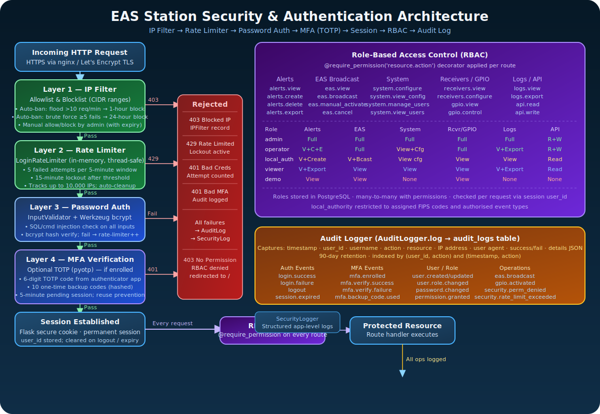
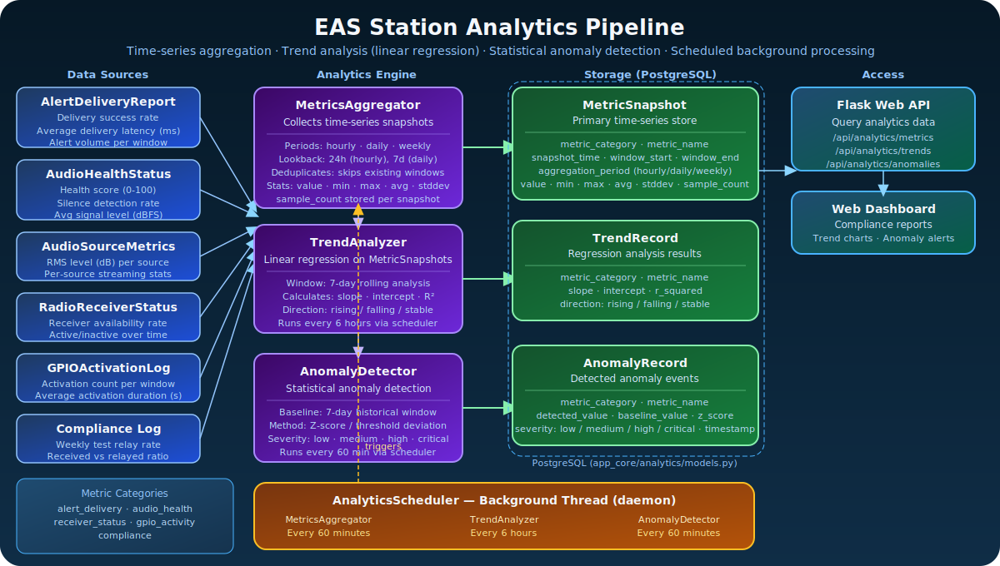

# EAS Station Visual Documentation

This page provides an index of all professional diagrams and flowcharts available in the EAS Station documentation. These visual resources complement the written documentation and help understand system architecture, workflows, and deployment configurations.

## 📊 Professional SVG Diagrams

### System Architecture & Workflows

#### 1. Alert Processing Pipeline

**Complete CAP alert ingestion workflow** showing data flow from external sources (NOAA/IPAWS) through validation, parsing, spatial processing, duplicate checking, and database storage.


**Key Features:**
- External CAP feed sources
- XML parsing and schema validation
- Geometry processing (polygon/circle/SAME codes)
- Duplicate detection
- Spatial intelligence with PostGIS
- Database persistence

**Use Cases:**
- Understanding how alerts enter the system
- Debugging alert ingestion issues
- Planning CAP feed integrations

**File:** [`../assets/diagrams/alert-processing-pipeline.svg`](../assets/diagrams/alert-processing-pipeline.svg)

---

#### 2. EAS Broadcast Workflow

**Step-by-step EAS message generation and transmission** from operator initiation through SAME encoding, TTS narration, and final broadcast.


**Key Features:**
- Alert source selection (manual vs. CAP)
- Message configuration
- SAME header generation and validation
- Optional TTS narration
- Complete audio assembly (header × 3, attention signal, narration, EOM × 3)
- Operator approval process
- Transmission via GPIO-controlled transmitter

**Use Cases:**
- Training new operators
- Understanding broadcast procedures
- Troubleshooting workflow errors

**File:** [`../assets/diagrams/broadcast-workflow.svg`](../assets/diagrams/broadcast-workflow.svg)

---

#### 3. SDR Setup & Configuration Flow

**Complete visual guide for setting up Software-Defined Radio receivers** including hardware selection, software configuration, and testing procedures.


**Key Features:**
- **Phase 1:** Hardware setup (RTL-SDR, Airspy, antennas)
- **Phase 2:** Software configuration via web UI
  - Access settings
  - Run diagnostics
  - Discover devices
  - Apply presets
  - Fine-tune parameters
- **Phase 3:** Testing and verification
  - Monitor receiver status
  - Verify signal quality
  - Troubleshooting guide

**Use Cases:**
- Initial SDR receiver setup
- Adding new receivers
- Troubleshooting receiver issues

**File:** [`../assets/diagrams/sdr-setup-flow.svg`](../assets/diagrams/sdr-setup-flow.svg)

**Related Documentation:** [SDR Setup Guide](../hardware/SDR_SETUP)

---

#### 4. Audio Source Routing Architecture

**Multi-source audio ingestion system** showing how different audio sources are routed through adapters, controllers, and monitoring systems.


**Key Features:**
- **Audio Sources:** SDR, ALSA, PulseAudio, File playback
- **Source Adapters:** Convert various formats to unified PCM
- **Audio Controller:** Priority selection and buffer management
- **Monitoring:** Peak/RMS metering, silence detection, health scoring
- **Database Integration:** Metrics, health status, alerts
- **Web UI:** Real-time monitoring and API access

**Use Cases:**
- Understanding audio pipeline architecture
- Configuring audio sources
- Debugging audio issues
- Implementing new source types

**File:** [`../assets/diagrams/audio-source-routing.svg`](../assets/diagrams/audio-source-routing.svg)

**Related Documentation:** [Audio Documentation](audio)

---

#### 5. Hardware Deployment Architecture

**Physical deployment diagram** showing the complete Raspberry Pi 5 reference configuration with all peripherals, storage, and external connections.


**Key Features:**
- **USB Peripherals:** RTL-SDR, Airspy, USB audio DAC
- **GPIO Connections:** Relay HAT for transmitter control
- **Storage:** NVMe SSD via PCIe Gen 2
- **Network:** Gigabit Ethernet
- **Display:** HDMI monitor support
- **External Systems:** FM transmitter, LED signs, web browser access
- **Cost Analysis:** ~$585 vs. $5,000-$7,000 for commercial systems

**Use Cases:**
- Planning hardware purchases
- Physical installation
- Understanding connections
- Troubleshooting hardware issues

**File:** [`../assets/diagrams/system-deployment-hardware.svg`](../assets/diagrams/system-deployment-hardware.svg)

**Related Documentation:** [README - System Requirements](https://github.com/KR8MER/eas-station/blob/main/README.md#system-requirements)

---

#### 6. Security &amp; Authentication Architecture

**Multi-layer security pipeline** from incoming HTTP request through IP filtering, rate limiting, password authentication, MFA (TOTP), session management, role-based access control, and audit logging.



**Key Features:**
- **Layer 1 — IP Filter:** Allowlist/blocklist with CIDR support; auto-ban for flood (&gt;10 req/min, 1h) and brute force (≥5 fails, 24h)
- **Layer 2 — Rate Limiter:** 5 failed attempts per 5-minute window; 15-minute lockout; thread-safe in-memory tracking
- **Layer 3 — Password Auth:** Werkzeug bcrypt hash verification; failures increment rate-limiter count
- **Layer 4 — MFA (TOTP):** Optional pyotp 6-digit codes; 10 one-time backup codes; 5-minute pending session timeout; reuse prevention
- **RBAC:** 5 roles (admin, operator, local_authority, viewer, demo); 22 permissions in resource.action format; `@require_permission` decorator per route
- **Audit Logger:** Comprehensive event logging to `audit_logs` table with IP, user agent, success/fail, 90-day retention

**Use Cases:**
- Understanding the security model
- Planning user roles and permissions
- Auditing access patterns
- Onboarding new administrators

**File:** [`../assets/diagrams/security-auth-architecture.svg`](../assets/diagrams/security-auth-architecture.svg)

---

#### 7. Analytics Pipeline

**Time-series analytics pipeline** showing data collection from operational sources through aggregation, trend analysis, and anomaly detection into a scheduled background system.



**Key Features:**
- **Data Sources:** AlertDeliveryReport, AudioHealthStatus, AudioSourceMetrics, RadioReceiverStatus, GPIOActivationLog, ComplianceLog
- **MetricsAggregator:** Hourly/daily/weekly snapshots with min/max/avg/stddev; deduplicates existing windows
- **TrendAnalyzer:** 7-day rolling linear regression; calculates slope, intercept, R²; classifies direction (rising/falling/stable)
- **AnomalyDetector:** Statistical Z-score detection against 7-day baseline; severity levels (low/medium/high)
- **AnalyticsScheduler:** Background daemon thread; metrics every 60 min, trends every 6 hours, anomalies every 60 min
- **Metric Categories:** alert_delivery · audio_health · receiver_status · gpio_activity · compliance

**Use Cases:**
- Understanding the analytics data model
- Compliance reporting and audit trails
- System health trend monitoring
- Configuring alerting thresholds

**File:** [`../assets/diagrams/analytics-pipeline.svg`](../assets/diagrams/analytics-pipeline.svg)

---

## 🗺️ Legacy Architecture Diagrams (SVG)

These diagrams were created earlier and provide high-level system overviews:

### System Architecture Overview

**High-level platform architecture** showing major components and data flows.


**File:** [`../assets/diagrams/eas-station-architecture.svg`](../assets/diagrams/eas-station-architecture.svg)

---

### Core Services Overview

**Core services diagram** showing three main operational areas in a dark theme design.


**File:** [`../assets/diagrams/core-services-overview.svg`](../assets/diagrams/core-services-overview.svg)

---

## 📐 Mermaid Diagrams in Documentation

In addition to the professional SVG diagrams above, the following documentation files contain embedded Mermaid.js diagrams that render in GitHub, GitLab, and compatible markdown viewers:

### Data Flow Sequences (Mermaid)

**File:** [docs/../architecture/DATA_FLOW_SEQUENCES.md](../architecture/DATA_FLOW_SEQUENCES)

**Contains:**
- **Alert Processing Data Flow** - Complete CAP alert path from fetch to storage
- **SDR Continuous Monitoring Data Flow** - RF signal to digital samples conversion
- **Multi-Source Audio Ingest Data Flow** - Audio from multiple sources through adapters
- **Radio Capture Coordination Data Flow** - Coordinated capture triggering during broadcast
- **EAS Message Generation Data Flow** - Alert to SAME to audio file generation
- **Complete Alert-to-Broadcast Pipeline** - End-to-end flow with all components

**Rendering:**
- ✅ **GitHub**: Native Mermaid rendering in markdown
- ✅ **MkDocs Site**: Automatic rendering via pymdownx.superfences
- ✅ **Local Viewing**: Renders in any Mermaid-compatible markdown viewer

**Use Cases:**
- Understanding how data moves through the system
- Tracing data transformations at each stage
- Debugging data flow issues
- Onboarding developers to system architecture
- Planning modifications to data processing paths

### System Architecture (Mermaid)

**File:** [docs/../architecture/SYSTEM_ARCHITECTURE.md](../architecture/SYSTEM_ARCHITECTURE)

**Contains:**
- High-level architecture graph
- Component dependency map
- Alert processing sequence diagram
- Alert ingestion flowchart
- Spatial processing flowchart
- Audio ingest architecture
- Audio source lifecycle state diagram
- Audio metrics sequence diagram
- EAS workflow flowchart
- SAME generation flowchart
- Audio generation pipeline sequence
- SDR capture & verification flowchart
- Verification workflow sequence
- Database entity-relationship diagram
- Data flow diagrams
- Web request flow sequence
- System health monitoring flowchart
- Multi-service coordination diagram
- Deployment architecture diagrams

### Theory of Operation (Mermaid)

**File:** [docs/../architecture/THEORY_OF_OPERATION.md](../architecture/THEORY_OF_OPERATION)

**Contains:**
- High-level flow diagram
- Conceptual overview of system operation
- Historical context and SAME protocol details

### Display System Architecture (Mermaid)

**File:** [docs/../architecture/DISPLAY_SYSTEM_ARCHITECTURE.md](../architecture/DISPLAY_SYSTEM_ARCHITECTURE)

**Contains:**
- OLED preview system architecture
- Display update cycle sequence diagram
- OLED scrolling performance architecture (main loop, timing precision, seamless loop)
- Visual screen editor component structure
- Editor state management state diagram
- Data binding flow
- Screen rendering pipeline (template to display)
- Variable substitution engine
- Screen rotation and alert preemption workflow
- Alert preemption sequence diagram
- Visual editor to display integration flow
- Frame timing Gantt chart
- Display system future enhancements mindmap

**Use Cases:**
- Understanding OLED/VFD/LED display management
- Debugging scrolling performance issues
- Contributing to the visual screen editor
- Understanding the screen rotation system

### EAS Decoding Architecture (Mermaid)

**File:** [docs/../architecture/EAS_DECODING_SUMMARY.md](../architecture/EAS_DECODING_SUMMARY)

**Contains:**
- Shared `SAMEDemodulatorCore` architecture showing how both the streaming and file decoders share a single DSP engine
- IIR bandpass filter, ENDEC mode detection, and burst timing tracker components

**Use Cases:**
- Understanding the two-decoder architecture (streaming vs. file)
- Tracing the DSP pipeline from audio input to decoded alert
- Contributing improvements to the shared demodulator core

### Hardware Isolation Architecture (Mermaid)

**File:** [docs/../architecture/HARDWARE_ISOLATION.md](../architecture/HARDWARE_ISOLATION)

**Contains:**
- USB hardware layer isolation diagram
- SDR service / hardware service coordination sequence
- Before/after architecture comparison (old vs. new hardware access model)

**Use Cases:**
- Understanding why USB hardware is isolated into separate services
- Debugging USB device access issues
- Planning new hardware integrations

### Ohio EAS Documentation (Mermaid)

**File:** [docs/../reference/OHIO_EAS_DOCUMENTATION.md](../reference/OHIO_EAS_DOCUMENTATION)

**Contains:**
- Ohio EAS coverage and county hierarchy
- FCC regulatory framework
- National Primary station distribution
- Emergency alert notification type tree
- Alert origination sequence diagram
- State-level authority and routing diagrams
- NWS office coverage
- RWT/RMT test schedule and requirements
- Annual test cycle Gantt chart
- Regional LP-1 relay chains (Central, Northwest, Southwest, Southeast)
- LP-2 relay chain sequence diagram

**Use Cases:**
- Understanding Ohio-specific EAS plan requirements
- Planning LP-1 and LP-2 monitoring configurations
- Understanding RWT/RMT compliance obligations

### SDR Troubleshooting Flowchart (Mermaid)

**File:** [docs/../troubleshooting/SDR_TROUBLESHOOTING_FLOWCHART.md](../troubleshooting/SDR_TROUBLESHOOTING_FLOWCHART)

**Contains:**
- Step-by-step SDR diagnostic decision tree from USB detection through signal quality

**Use Cases:**
- Systematic SDR problem diagnosis
- Training new operators on SDR troubleshooting

### SDR Setup Flow (Mermaid)

**File:** [docs/../hardware/SDR_SETUP.md](../hardware/SDR_SETUP)

**Contains:**
- Three-phase SDR setup flowchart (hardware, software configuration, testing)

**Use Cases:**
- Guided SDR initial setup
- Adding new receivers

### Notification Delivery Flow (Mermaid)

**File:** [docs/../guides/notifications.md](../guides/notifications)

**Contains:**
- Sequence diagram showing how EAS alerts trigger email (SMTP) and SMS (Twilio) notifications after a broadcast

**Use Cases:**
- Understanding the post-broadcast notification pipeline
- Troubleshooting email or SMS delivery issues

### EAS Test Signal Pipeline (Mermaid)

**File:** [docs/../audio/EAS_TEST_SIGNAL_PIPELINE.md](../audio/EAS_TEST_SIGNAL_PIPELINE)

**Contains:**
- End-to-end flowchart of the **Inject Test Signal** feature, from operator button click through FSK generation → SAME decoder → EASBroadcaster → Icecast stream → stream listeners
- Step-by-step table of all 16 pipeline stages with file references
- Explanation of the two separate audio queues (`_eas_broadcast` vs `_source_broadcast`) and why they exist
- What the test confirms when it passes (12 verified components)
- Failure mode checklist for when audio is not heard in the stream

**Use Cases:**
- Understanding what the Inject Test Signal button actually tests
- Diagnosing why audio is not appearing in the Icecast stream after a test
- Onboarding operators who need to verify the full EAS pipeline
- Developers tracing the multi-process, multi-queue audio path

### README Architecture (Mermaid)

**File:** [README.md](https://github.com/KR8MER/eas-station/blob/main/README.md)

**Contains:**
- Simple architecture overview
- Component technology stack

---

## 📖 Usage Guidelines

### Viewing Diagrams

- **On GitHub/GitLab:** All diagrams render automatically
- **Locally:** Open SVG files in any modern web browser
- **In Documentation:** Embedded images display inline
- **Full Size:** Click any diagram to view at full resolution

### Embedding Diagrams

To embed these diagrams in your own documentation:

```markdown

```

Or with a link to full-size view:

```markdown
[](path/to/diagram.svg)
```

### Diagram Standards

All professional SVG diagrams follow these standards:

- **Format:** SVG 1.1 with embedded metadata
- **Accessibility:** Include `<title>` and `<desc>` tags
- **Resolution:** Optimized for both web and print
- **Color Scheme:** Consistent palette across all diagrams
- **Typography:** Arial/sans-serif for maximum compatibility
- **Icons:** Semantic shapes and colors for clarity

### Contributing New Diagrams

When adding new diagrams:

1. Save as SVG in `docs/../assets/diagrams/` directory
2. Use consistent color scheme and typography
3. Include accessibility metadata (title, description)
4. Add to this index page
5. Reference in relevant documentation
6. Update the changelog

---

## 🔗 Related Documentation

- **[System Architecture](../../architecture/SYSTEM_ARCHITECTURE)** - Complete technical architecture with Mermaid diagrams
- **[Theory of Operation](../../architecture/THEORY_OF_OPERATION)** - Conceptual overview and operational theory
- **[Display System Architecture](../../architecture/DISPLAY_SYSTEM_ARCHITECTURE)** - OLED/VFD/LED display management
- **[EAS Decoding Summary](../../architecture/EAS_DECODING_SUMMARY)** - Streaming vs. file decoder architecture
- **[SDR Setup Guide](../../hardware/SDR_SETUP)** - Radio receiver configuration
- **[Audio Documentation](../audio/AUDIO_MONITORING)** - Audio system details
- **[Notifications Guide](../guides/notifications)** - Email and SMS notification setup
- **[README](https://github.com/KR8MER/eas-station/blob/main/README.md)** - Project overview and quick start

---

**Last Updated:** 2026-03-25
**Diagram Count:** 9 professional SVG diagrams + 79 embedded Mermaid diagrams across 12 documentation files
**Total Documentation Coverage:** Complete system from hardware to software, including security architecture, analytics pipeline, display system, EAS decoding, notifications, EAS test signal pipeline, and detailed data processing flows
