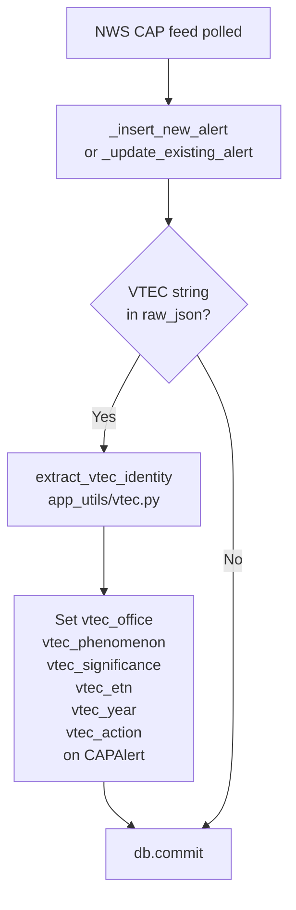
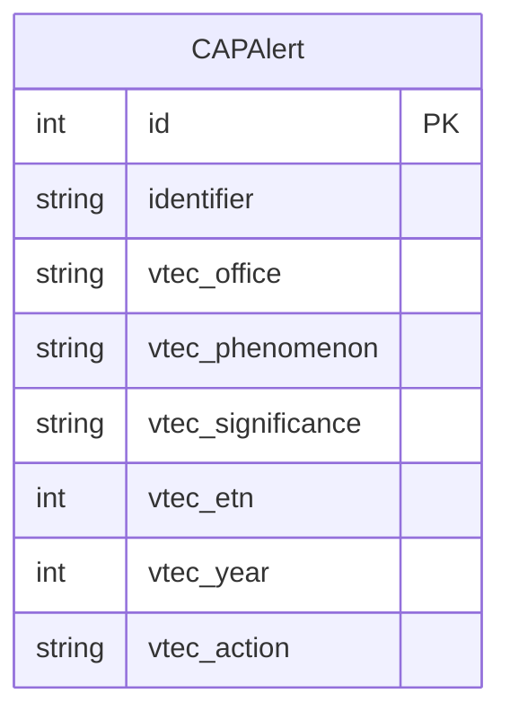
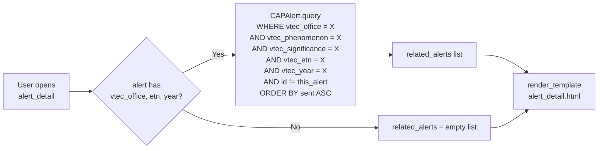
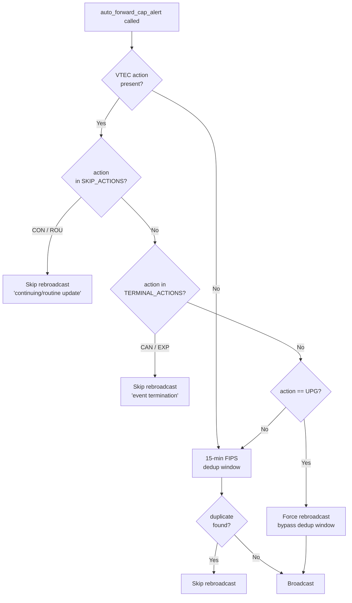
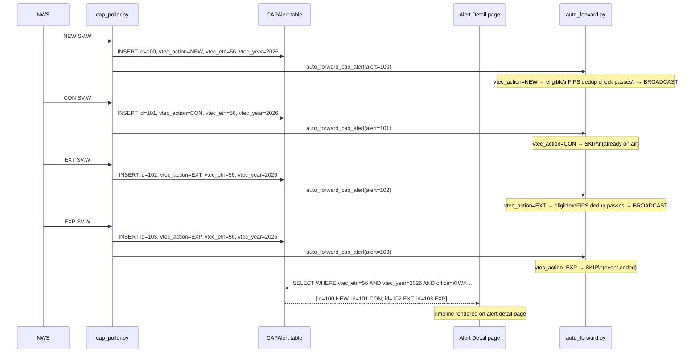

# VTEC Event Linking

EAS Station uses the VTEC **Event Tracking Number (ETN)** to link every update
to a weather event into a single lifecycle chain.  This document explains the
data model, the ingest flow, and how the alert detail page surfaces related
updates.

For the VTEC string format itself (field definitions, action codes, phenomena
codes, etc.) see [`NWS_ALERT_PARAMETERS.md`](NWS_ALERT_PARAMETERS.md).

---

## Why VTEC-Based Linking?

NWS issues multiple CAP alerts for the same physical event:

```
NEW  → (event starts)
CON  → (hourly reissues confirming the event is ongoing)
EXT  → (valid time extended)
CAN  → (event cancelled early)
EXP  → (event expires at the originally-stated time)
```

Without VTEC, each alert looks like an independent record.  With VTEC,
every update shares an identical **event key**:

| Field             | Example  | Notes                             |
|-------------------|----------|-----------------------------------|
| `vtec_office`     | `KIWX`   | 4-letter NWS office ID            |
| `vtec_phenomenon` | `SV`     | 2-letter phenomenon code          |
| `vtec_significance` | `W`    | 1-letter significance (W/A/Y/…)   |
| `vtec_etn`        | `56`     | Event Tracking Number (1–9999)    |
| `vtec_year`       | `2026`   | Derived from end-time in VTEC string |

All five fields together form the stable key for one NWS event.

---

## Data Flow

### 1. Ingest (cap_poller.py)



`extract_vtec_identity()` reads the first P-VTEC string from
`raw_json.properties.parameters.VTEC[]` and returns a dict of the six
columns, or `None` if VTEC is absent or unparseable.

### 2. Database Schema



A composite index `ix_cap_alerts_vtec_event_key` covers all five key fields
for O(log n) lookups.  Individual indexes on each column support filtering
by single dimension (e.g. all alerts from `KIWX`).

Migration: `app_core/migrations/versions/20260327_add_vtec_columns_to_cap_alerts.py`

### 3. Alert Detail Page (webapp/admin/api.py)

When a user opens an alert detail page the route queries for siblings:



The resulting `related_alerts` list is rendered as a vertical timeline on
the detail page.

---

## Broadcast Deduplication

VTEC action codes gate automatic rebroadcast in `app_core/audio/auto_forward.py`:



| Action set constant        | Actions      | Broadcast decision                      |
|----------------------------|--------------|-----------------------------------------|
| `VTEC_SKIP_ACTIONS`        | CON, ROU     | Suppress — already on air               |
| `VTEC_TERMINAL_ACTIONS`    | CAN, EXP     | Suppress — event is over                |
| `VTEC_BROADCAST_ACTIONS`   | NEW, EXT, EXA, EXB, UPG, COR | Eligible for broadcast |
| UPG (special case)         | UPG          | Force — bypass the 15-min FIPS window   |

All three sets are defined in `app_utils/vtec.py` and imported from there by
both `cap_poller.py` and `auto_forward.py`, keeping the logic in one place.

---

## Code Location Summary

| Responsibility                    | File                                                      |
|-----------------------------------|-----------------------------------------------------------|
| VTEC string parsing & code tables | `app_utils/vtec.py`                                       |
| VTEC columns on CAPAlert model    | `app_core/models.py`                                      |
| Alembic migration                 | `app_core/migrations/versions/20260327_add_vtec_columns_to_cap_alerts.py` |
| Ingest: extract & persist VTEC    | `poller/cap_poller.py` → `_insert_new_alert`, `_update_existing_alert` |
| Broadcast dedup gating            | `app_core/audio/auto_forward.py` → `auto_forward_cap_alert` |
| Related alerts query              | `webapp/admin/api.py` → `alert_detail`                    |
| Event chain timeline (UI)         | `templates/alert_detail.html` (VTEC Event Chain block)    |

---

## Full Lifecycle Example


