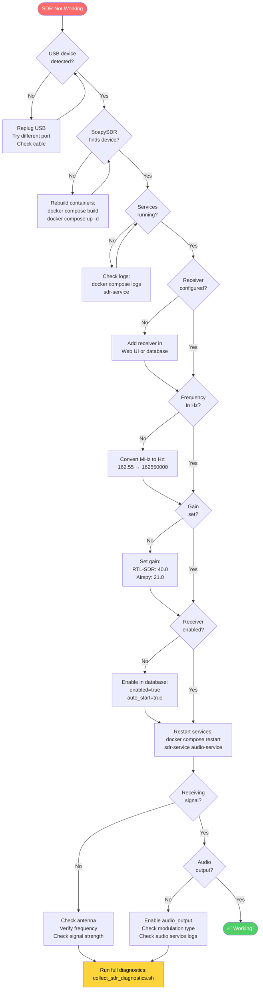

# SDR Troubleshooting Flowchart

**Visual guide to diagnosing SDR issues step-by-step**

---

## Quick Reference Flowchart



---

## Detailed Decision Tree

### Level 1: Hardware Detection

```
┌─────────────────────────────────────┐
│ Is USB device physically detected? │
│ Command: lsusb | grep -E "RTL|Airspy" │
└───────────┬─────────────────────────┘
            │
    ┌───────┴───────┐
    │               │
   YES             NO
    │               │
    │          ┌────┴─────┐
    │          │ Hardware │
    │          │ Problem  │
    │          └──────────┘
    │               │
    │          • Replug USB
    │          • Different port
    │          • Different cable
    │          • Check device LED
    │          • Try another PC
    │
    ▼
┌─────────────────────────────────────┐
│ Can SoapySDR enumerate the device? │
│ Command: SoapySDRUtil --find       │
└─────────────────────────────────────┘
```

### Level 2: Software Detection

```
┌─────────────────────────────────────┐
│ Can SoapySDR enumerate the device? │
└───────────┬─────────────────────────┘
            │
    ┌───────┴───────┐
    │               │
   YES             NO
    │               │
    │          ┌────┴─────────┐
    │          │   Driver     │
    │          │   Problem    │
    │          └──────────────┘
    │               │
    │          • Rebuild containers
    │          • Check USB permissions
    │          • Install drivers
    │          • Check /dev/bus/usb
    │
    ▼
┌─────────────────────────────────────┐
│ Are Docker services running?        │
│ Command: docker compose ps          │
└─────────────────────────────────────┘
```

### Level 3: Service Status

```
┌─────────────────────────────────────┐
│ Are Docker services running?        │
└───────────┬─────────────────────────┘
            │
    ┌───────┴───────┐
    │               │
   ALL UP      RESTARTING
    │               │
    │          ┌────┴──────────┐
    │          │   Service     │
    │          │   Problem     │
    │          └───────────────┘
    │               │
    │          • Check logs
    │          • Device in use?
    │          • Permission error?
    │          • Config error?
    │
    ▼
┌─────────────────────────────────────┐
│ Is receiver configured in database? │
│ Table: radio_receivers              │
└─────────────────────────────────────┘
```

### Level 4: Configuration

```
┌─────────────────────────────────────┐
│ Is receiver configured correctly?   │
└───────────┬─────────────────────────┘
            │
            ▼
┌─────────────────────────────────────┐
│ Frequency Check                     │
│ • In Hz? (> 1,000,000)              │
│ • Example: 162.55 MHz = 162550000 Hz│
└───────────┬─────────────────────────┘
            │
            ▼
┌─────────────────────────────────────┐
│ Gain Check                          │
│ • Not NULL or 0                     │
│ • RTL-SDR: 40.0 typical             │
│ • Airspy: 21.0 typical              │
└───────────┬─────────────────────────┘
            │
            ▼
┌─────────────────────────────────────┐
│ Sample Rate Check                   │
│ • RTL-SDR: 2400000 typical          │
│ • Airspy R2: 2500000 or 10000000    │
│   (ONLY these two rates!)           │
└───────────┬─────────────────────────┘
            │
            ▼
┌─────────────────────────────────────┐
│ Enabled Check                       │
│ • enabled = true                    │
│ • auto_start = true                 │
└───────────┬─────────────────────────┘
            │
            ▼
┌─────────────────────────────────────┐
│ Modulation Check                    │
│ • NOAA Weather: NFM                 │
│ • Broadcast FM: WFM or FM           │
│ • AM stations: AM                   │
└─────────────────────────────────────┘
```

### Level 5: Audio Output

```
┌─────────────────────────────────────┐
│ Is audio being produced?            │
└───────────┬─────────────────────────┘
            │
    ┌───────┴───────┐
    │               │
   YES             NO
    │               │
    │          ┌────┴──────────┐
    │          │     Audio     │
    │          │    Problem    │
    │          └───────────────┘
    │               │
    │          • audio_output = true?
    │          • Correct modulation?
    │          • Check audio service logs
    │          • Audio source configured?
    │
    ▼
┌─────────────────────────────────────┐
│          ✅ SUCCESS!                │
│   SDR is working correctly          │
└─────────────────────────────────────┘
```

---

## Priority-Based Troubleshooting

### 🔴 Critical (Fix First)

1. **Hardware not detected** → No USB device visible
2. **Container restarting** → Service crash loop
3. **SoapySDR can't find device** → Driver issue

### 🟡 Important (Fix Second)

4. **Frequency in MHz not Hz** → Wrong frequency value
5. **No gain set** → Gain is NULL or 0
6. **Receiver not enabled** → enabled=false or auto_start=false

### 🟢 Minor (Fix Last)

7. **Wrong modulation type** → Audio sounds wrong
8. **Suboptimal gain** → Signal too weak or too strong
9. **Audio output disabled** → No sound

---

## Command Reference by Stage

### Stage 1: Hardware Check
```bash
# Check USB device
lsusb | grep -E "RTL|Airspy|Realtek"

# Expected: Device appears in list
```

### Stage 2: Driver Check
```bash
# Check SoapySDR can see device
docker compose exec app SoapySDRUtil --find

# Expected: JSON with driver, label, serial
```

### Stage 3: Service Check
```bash
# Check all services
docker compose ps

# Expected: All show "Up" status

# Check logs if problems
docker compose logs sdr-service --tail=50
```

### Stage 4: Configuration Check
```bash
# View configuration
docker compose exec app psql -U postgres -d alerts -c "
  SELECT identifier, frequency_hz, frequency_hz/1e6 as mhz, 
         gain, enabled, auto_start 
  FROM radio_receivers;
"

# Expected: 
# - frequency_hz > 1000000
# - gain is not NULL
# - enabled = t
# - auto_start = t
```

### Stage 5: Fix and Restart
```bash
# After making configuration changes
docker compose restart sdr-service audio-service

# Wait 10 seconds, then check
docker compose logs sdr-service | grep -i "started\|error"
```

### Stage 6: Verify Audio
```bash
# Check audio processing
docker compose logs audio-service | grep "audio chunk"

# Expected: Periodic "audio chunk decoded" messages
```

---

## Common Problem Patterns

### Pattern A: New Installation
```
Problem: No devices found
Cause: Fresh install, no configuration
Fix: Run device discovery in Web UI
```

### Pattern B: After Config Change
```
Problem: Changes not taking effect
Cause: Services not restarted
Fix: docker compose restart sdr-service audio-service
```

### Pattern C: Frequency Issues
```
Problem: Noise instead of signal
Cause: Frequency in MHz not Hz
Fix: Multiply frequency by 1,000,000
```

### Pattern D: Weak/No Audio
```
Problem: Signal detected but no/weak audio
Cause: Gain not set or too low
Fix: Set gain to 40.0 (RTL-SDR) or 21.0 (Airspy)
```

### Pattern E: Airspy Specific
```
Problem: Airspy not working
Cause: Invalid sample rate
Fix: Use only 2500000 or 10000000 Hz
```

---

## Quick Decision Matrix

| Symptom | Most Likely Cause | Quick Fix |
|---------|-------------------|-----------|
| No USB device | Hardware unplugged | Replug, check cable |
| USB device but no SoapySDR | Driver missing | Rebuild containers |
| SoapySDR works but service crashes | Permission or in-use | Check logs, kill other SDR apps |
| Service runs but no receiver | Not configured | Add in Web UI |
| Receiver exists but no signal | Wrong frequency | Check frequency in Hz |
| Signal but no audio | Gain too low | Set gain = 40.0 |
| Audio is noise | Wrong modulation | Set to NFM for NOAA |

---

## Emergency Shortcuts

### 1-Minute Fix Attempt
```bash
# Try the most common fixes
docker compose restart sdr-service audio-service
docker compose exec app psql -U postgres -d alerts -c "
  UPDATE radio_receivers 
  SET gain = 40.0, enabled = true, auto_start = true;
"
docker compose restart sdr-service audio-service
```

### 5-Minute Full Diagnostic
```bash
# Run comprehensive diagnostic
bash scripts/collect_sdr_diagnostics.sh
```

### 10-Minute Deep Dive
```bash
# Follow the master troubleshooting guide
less docs/troubleshooting/SDR_MASTER_TROUBLESHOOTING_GUIDE.md
```

---

## When to Give Up and Ask for Help

If you've tried all of the following and SDR still doesn't work:

- ✅ Checked hardware (USB, cable, device LED)
- ✅ Verified SoapySDR detects device
- ✅ Confirmed services are running
- ✅ Fixed configuration (frequency, gain, enabled)
- ✅ Restarted services
- ✅ Tested with known-good frequency (local FM station)
- ✅ Run full diagnostic script

Then:
1. Run `bash scripts/collect_sdr_diagnostics.sh`
2. Save the output file
3. Open GitHub issue with diagnostic file attached
4. Describe what you've tried

---

## Related Documentation

- **[SDR Quick Fix Guide](SDR_QUICK_FIX_GUIDE.md)** - Fast solutions
- **[SDR Master Troubleshooting Guide](SDR_MASTER_TROUBLESHOOTING_GUIDE.md)** - Complete procedures
- **[SDR Setup Guide](../hardware/SDR_SETUP.md)** - Initial setup
- **[Diagnostic Scripts](../../scripts/diagnostics/README.md)** - Available tools

---

**Flowchart Version:** 1.0  
**Last Updated:** December 2025
