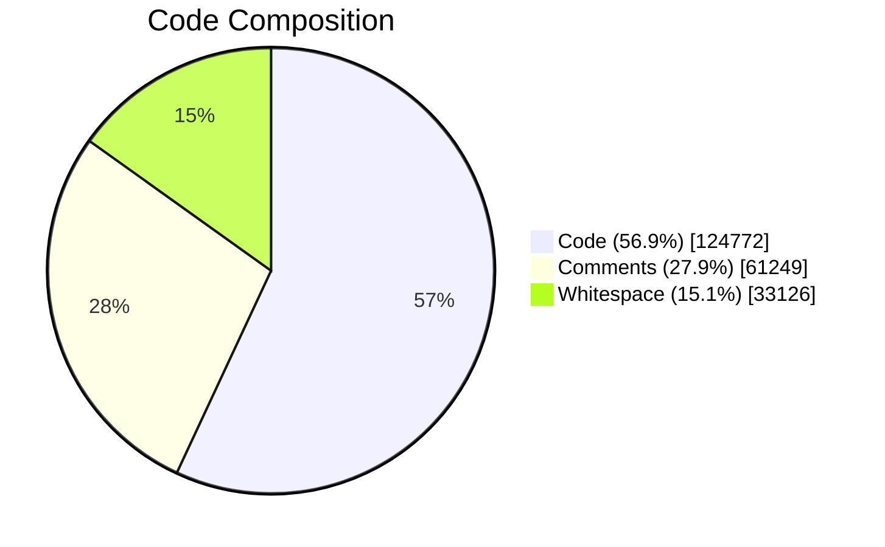
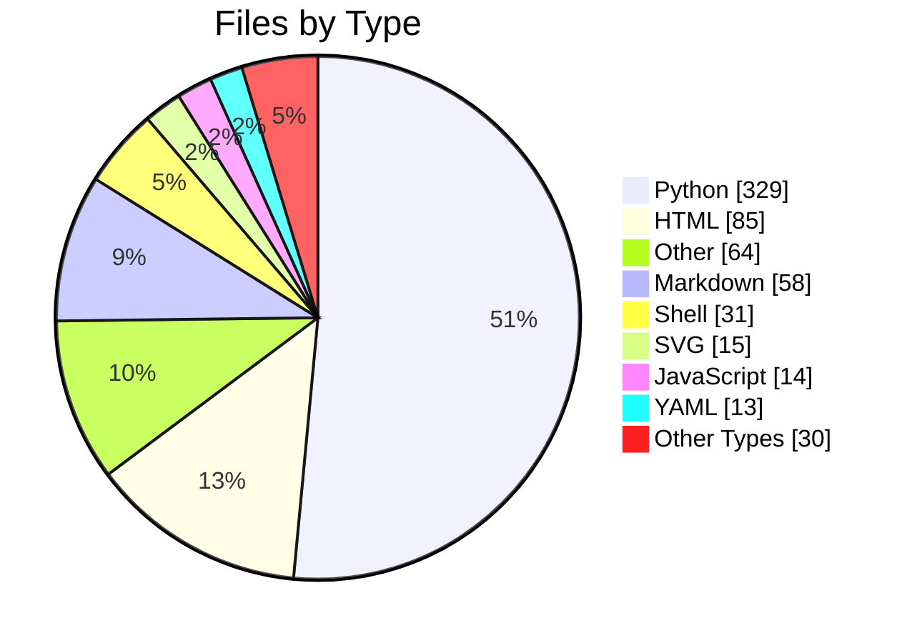
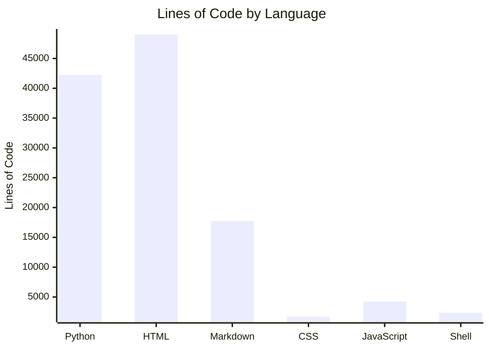

# 📊 EAS Station Repository Statistics

> **Last Updated:** 2025-12-02 18:37:56 UTC

---

## 🎯 Quick Stats

| Metric | Value |
|--------|-------|
| 📁 Total Files | **639** |
| 📂 Directories | **74** |
| 📝 Total Lines | **219,147** |
| 💻 Code Lines | **124,772** |
| 💬 Comment Lines | **61,249** |
| 🛤️ API Routes | **193** |



---

## 📁 Files by Type



| Type | Count | |
|------|------:|--|
| 🐍 Python | 329 | `▓▓▓▓▓▓▓▓▓▓▓▓▓▓▓▓▓▓▓▓` |
| 🌐 HTML | 85 | `▓▓▓▓▓░░░░░░░░░░░░░░░` |
| 📦 Other | 64 | `▓▓▓░░░░░░░░░░░░░░░░░` |
| 📝 Markdown | 58 | `▓▓▓░░░░░░░░░░░░░░░░░` |
| 🐚 Shell | 31 | `▓░░░░░░░░░░░░░░░░░░░` |
| 🖼️ SVG | 15 | `░░░░░░░░░░░░░░░░░░░░` |
| ⚡ JavaScript | 14 | `░░░░░░░░░░░░░░░░░░░░` |
| ⚙️ YAML | 13 | `░░░░░░░░░░░░░░░░░░░░` |
| 🎨 CSS | 12 | `░░░░░░░░░░░░░░░░░░░░` |
| 📃 Text | 8 | `░░░░░░░░░░░░░░░░░░░░` |
| 🗄️ SQL | 7 | `░░░░░░░░░░░░░░░░░░░░` |
| 📄 XML | 3 | `░░░░░░░░░░░░░░░░░░░░` |

---

## 📈 Lines of Code by Language

| Language | Total | Code | Comments | Code % |
|----------|------:|-----:|---------:|-------:|
| 🐍 Python | 116,237 | 42,218 | 53,952 | 36% |
| 🌐 HTML | 54,099 | 49,017 | 503 | 91% |
| 📝 Markdown | 23,137 | 17,761 | 0 | 77% |
| 🎨 CSS | 7,769 | 1,695 | 4,943 | 22% |
| ⚡ JavaScript | 5,737 | 4,246 | 727 | 74% |
| 🐚 Shell | 3,287 | 2,368 | 435 | 72% |
| ⚙️ YAML | 2,356 | 1,673 | 469 | 71% |
| 📃 Text | 2,212 | 2,068 | 0 | 93% |
| 🖼️ SVG | 1,941 | 1,483 | 195 | 76% |
| 📄 XML | 1,591 | 1,584 | 0 | 100% |
| 🗄️ SQL | 655 | 582 | 0 | 89% |
| 📦 Other | 126 | 77 | 25 | 61% |

---

## 📊 Code Distribution

### Top Languages by Lines of Code



**🐍 Python** (33.8%)
```
█████████████████████████░░░░░ 42,218
```

**🌐 HTML** (39.3%)
```
██████████████████████████████ 49,017
```

**📝 Markdown** (14.2%)
```
██████████░░░░░░░░░░░░░░░░░░░░ 17,761
```

**🎨 CSS** (1.4%)
```
█░░░░░░░░░░░░░░░░░░░░░░░░░░░░░ 1,695
```

**⚡ JavaScript** (3.4%)
```
██░░░░░░░░░░░░░░░░░░░░░░░░░░░░ 4,246
```

**🐚 Shell** (1.9%)
```
█░░░░░░░░░░░░░░░░░░░░░░░░░░░░░ 2,368
```

---

## 🛤️ API Routes by Module

| Module | Routes |
|--------|-------:|
| `routes_settings_radio` | 21 |
| `routes_screens` | 17 |
| `routes_public` | 14 |
| `routes_led` | 13 |
| `routes_vfd` | 12 |
| `routes_analytics` | 12 |
| `routes_monitoring` | 10 |
| `routes_setup` | 9 |
| `routes_stream_profiles` | 9 |
| `routes_backups` | 8 |
| `eas/workflow` | 8 |
| `routes/system_controls` | 7 |
| `routes/alert_verification` | 6 |
| `documentation` | 5 |
| `routes_debug` | 5 |
| *...and 13 more modules* | 37 |

---

## 🏗️ Architecture Overview

EAS Station uses a **separated service architecture**:

- **app** - Flask web UI, REST API (no hardware access)
- **sdr-service** - SDR capture, SAME decoding, Icecast streaming
- **hardware-service** - GPIO control, OLED/VFD displays, LED signs
- **Redis** - Real-time metrics and inter-service communication
- **PostgreSQL + PostGIS** - Persistent storage and spatial queries

---

*Generated by `scripts/generate_repo_stats.py`*